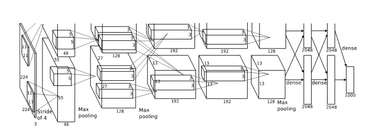
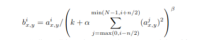

# [ImageNet Classification with Deep Convolutional Neural Networks](https://proceedings.neurips.cc/paper/2012/file/c399862d3b9d6b76c8436e924a68c45b-Paper.pdf)

## Key ideas
* You can use CUDA and deep CNNs to classify images (yes, this was absolutely novel!)
* Reduce overfitting via dropout
* Five conv layers + max pooling + fully connected layers + 1000-way softmax
* Won ImageNet

## Introduction
* Labeled datasets were small up until now (CIFAR is 32x32)
* ImageNet is one of such larger datasets with 15M labeled images in 22k categories
* Historically it's been prohibitely expensive to train CNNs for high-resolution images
* GPUs + optimized 2D convolution operations are enough to do it now

## Dataset
* 15M labeled images in 22k categories
* ILSVRC is 1k images in 1k categories, 1.2M training images, 50k validation set, 150k test set
* All images were down-sampled to 256x256
* Subtracted mean activity from the centered raw RGB values of the pixels

## Architecture
- 
* One GPU runs the top part, another runs the bottom one
* ReLU: f(x) = max(0,x) , versus the usual tanh or sigmoid are MUCH faster
* Multiple GPUs training: spread the net across 2 CPUs
  - GPUs communicate only in certain layers. E.g: kernels of layer 3 take input from kernels in layer 2 output only if they  reside in the same GPU
* Local response normalization
  - ReLU might not require normalization but it aids generalization
  - If a^i_x,y is the activity of a neuron applying kernel i at position (x,y), b^i_x,y or the normalized activity is
  - 

## Reducing overfitting
* Data augmentation: random horizontal flipping, translation, and cropping
  - Note: it's crazy that this was discovered then and it's still the most useful data augmentation technique
* Data augmentation: altering the intensities of the RGB channels and perform PCA on the set of RGB pixel values (color jittering)
* Dropout with probability 0.5 in the fully connected layers so that each neuron learns more robust features as it cannot rely on other neurons

## Details of learning and results (skipped)

## Discussion
* It's notable that even if a single conv layer is removed, the network performance degrades significantly
  - Hint that depth is important for achieving good results
* Aim is to use even deeper and larger networks that include even temporal structure for videos
