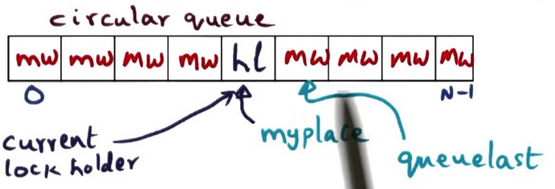
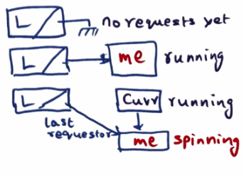
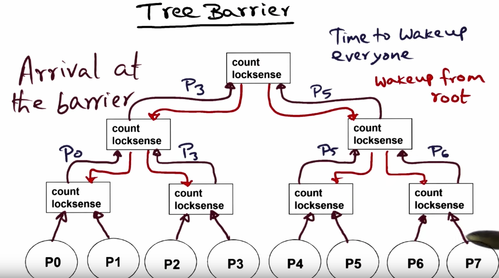
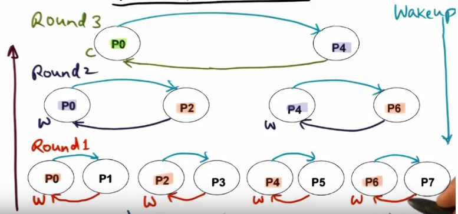
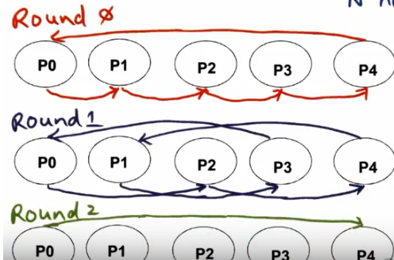
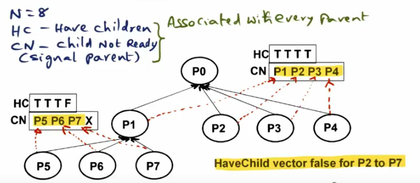
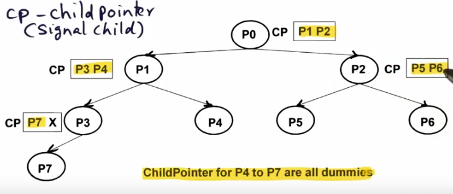

#[Algorithms for scalable synchronization on shared memory multiprocessors](http://www.cs.rice.edu/~johnmc/scalable_synch/tocs91.pdf)

## Key ideas
* busy-wait algorithms need not to induce memory or memory or interconnect contention
* every processor spins on local variables
* present an algorithm for spin lock / barrier sync

## Common atomic primitives
* fetch_and_set
* test_and_set
* fetch_and_store(swap)
* compare_and_swap

## test_and_set lock
* Polling a boolean variable that indicates whether the lock is held (shared memory)
* Each processor calls test_and_set(lock)
* Problem: high contention for lock
* Introducing exponential backoff for acquiring the lock helps reducing contention for the lock

```
lock = false

def acquire_lock(lock)
  while test_and_set(lock) == true
end

def release_lock(lock)
  lock = false
end
```

## Ticket lock
* Ensure fairness via FIFO over test_and_set
* 2 counters
  * Counter with # of requests to acquire lock
  * Counter with # of times lock has been released
* Acquire lock by spinning on request counter until processor ticket == release counter
* Release lock by incrementing release counter
* Contention because the release_counter polling is on a shared memory location

```
next_ticket, now_serving = 0

def acquire_lock
  my_ticket = fetch_and_increment(next_ticket)
  while now_serving != my_ticket
end

def release_lock
  now_serving += 1
end
```

## Array based queue lock
* Attempt to get a lock with a constant # of transactions
* Each processor spins on a different location
* Each processor can be in two states: has_lock or must_wait
* There's a global array 'flags' which contains 1 spot per processor
* Two variables per lock:
  * flags array
  * queuelast
* Processor is just concerned about his place in the queue



```
LOCK(L):
  myplace = fetch_and_increment(queuelast)
  while(flags[myplace % N] == mw)

UNLOCK(L):
  flags[myplace % N] = must_wait
  flags[(myplace + 1) % N] = has_lock
```

## MCS-lock (linked-list)
* Gurantees FIFO lock acquisition
* Spins on processor locally accessible variables
* O(1) network transactions per lock acquisition with and without coherent caches
* Every processor using the lock allocates a 'qnode' which contains:
  * 'next' link
  * boolean 'got_it'



```
LOCK(L, my_qnode)
  - join L atomically
    - changing last_requester.next to me
    - changing last_requester to me
  - wait predecessor to signal

UNLOCK(L, current)
  - remove current from L
  - signal successor by calling next.got_it = true
```

## Centralized barrier (sense-reversing)
* Spin on shared memory variable 'count', initialized to # of threads
* Processor has a private two-state flag 'sense' that indicates whether barrier has been reached
* Processor spins on 'sense' reversal
* All threads except the last one:
  * Decrement shared variable "count"
  * Spin on the private variable "sense" change (while sense != !sense)
* Last thread, where 'count' == 0
  * Reset 'count' to N
  * Invert sense value, sense = !sense

## Tree barrier
* Software combining of the 'count' shared variable
* Allows contention to be low because only two threads need to compete for decrementing the same variable
* Same as the sense-reversing centralized barrier but in a tree structure
* Every step of the tree has 2 variables - a countdown and the boolean 'sense'
* The last processor to arrive - the one that sets countdown to 0 - goes through to next step
* To alert the other threads when the root has been reached, go down the tree waking up the stuck levels
* Spins can be fast on a cache-coherent multiprocessor.



## Tournament barrier
* N players (processors) mean log2(N) rounds
* Matches are fixed, the tournament is already fixed
* Wake up signal from winner to loser


## Dissemination barrier
* Each round (k) Pi signals P(i+2) mod N
* O(N) communication events per round
* log2(N) synchronization operations limit
* Spins on private flag
* Parity variable 'i' is shared


## MCS barrier (4-ary arrival tree)
* Only spins on local variables, no contention
* O(P) space
* O(logP) network transactions
* Every parent has:
  * have_children - array of booleans represented whether the child exists
  * child_not_ready - indicate whether a child has arrive at a barrier
* On wake up, a binary tree is formed where every node has a child pointer structure



