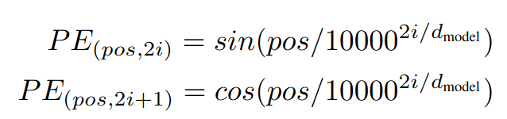

# [Attention Is All You Need](https://arxiv.org/abs/1706.03762)

## Key ideas
* Attention is a mechanism to increase the performance of RNNs
* If you look at the decoder, it only has the input of the last word + hidden state
* Connect encoder and decoder through attention mechanism: the Transformer
  - Dispensing with recurrence and convolutions entirely
* Generalizes really well

## Introduction
* Prior art are RNN, LSTM, GRU for language modeling and machine translation

## Model

* Encoder maps a sequence of symbol representations to a sequence of continuous representations
* Decoder generates output sequence of symbols one at a time
* Model consumes previously generated symbols as input when generating the next
* Change of paradigm: use attention instead of recurrences
* Embeddings:
  - Could be word vectors

## Attention

* Mapping of query and key-value pairs to an output
* Output is a weighted sum of the values, where the weight for each value depends on the compatibility function of query-key
* In practice we can compute the attention function on a set of queries simultaneously packing them in a matrix Q
* Attention(Q, K, V) = softmax((Q * Ktrans)/sqrt(dk)) * V
* dk is the dimension of the keys

## Positional encoding
* Key in the attention mechanism: it tells us where exactly each vector is located in the initial input
* Positional encoding uses sine and cosine functions of different frequencies

* Tried learned positional embeddings and worked similarly but at a much higher cost

## Why Self-Attention
* Total computational complexity per layer that can be parallelized
* Path length between long-range dependencies in the network
* Self-attention layer connects all positions with a constant number of sequentially executed operations
* Recurrent layers would require O(n) operations
* Side-effect: maybe this will yield more interpretable models

## Conclusion
* Plans to test this with audio images and video and not just sequenced vectors of text
* https://github.com/tensorflow/tensor2tensor

