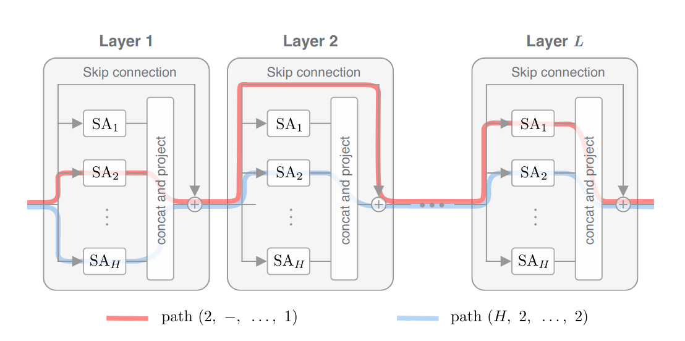
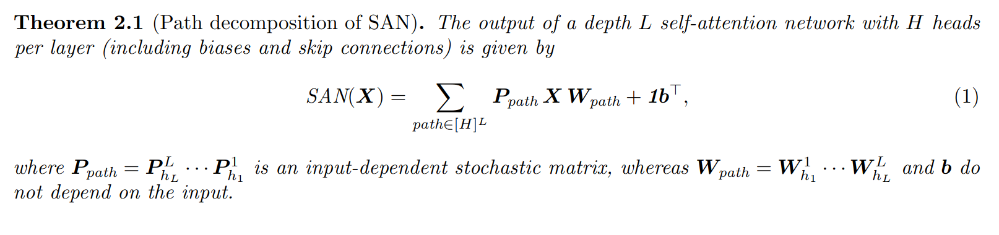

# [Attention Is Not All You Need: pure attention loses rank doubly exponentially with depth](https://arxiv.org/pdf/2103.03404.pdf)

## Key ideas
* Our understanding for why attention mechanisms work remains limited
* Show that output of attention layers can be decomposed into a sum of smaller terms
* Strong inductive bias of token uniformity deducted from these smaller terms
* Without skip-connections or multi-layer perceptrons, output converges doubly exponentially to a rank-1 matrix

## Introduction
* Attention mechanisms were introduced to better learn long-range sequential knowledge
* Stacking multiple self-attention layers show that expressiveness is lost the more layers that are added
* Question: why transformers work? Skip connections play a major role

* Path decomposition to study self-attention networks:
  - Decompose SAN to linear combination of weakly-dependent paths

## Attention doubly exponentially loses rank
* SANs converge exponentially (with depth) to a rank-1 matrix that makes all tokens identical
* Multi-head SAN as a sum of single-head networks
* Hence, SANs are a directed acyclic graph where nodes are self-attention heads and edges connections between layers

## Mechanisms that counteract rank collapse
* Hypothesis: too many short paths will make the SAN degenerate to rank-1 matrix
* Skip connections dramatically diversify the path distribution, helping counteract rank collapse
* Multi layer perceptrons: increase the Lipschitz constant
* Layer normalization plays no role
