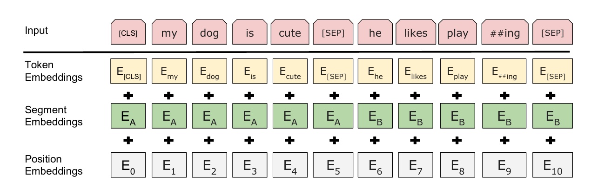

# [BERT: Pre-training of Deep Bidirectional Transformers for Language Understanding](https://arxiv.org/pdf/1810.04805v2.pdf)

## Key ideas
* Deep bi-dirctional representations from unlabeled text by joining conditionally on both left and right context on all layers
* Pre-trained BERT can be fine-tuned with just one additional layer for a wide-range of tasks.

## Introduction
* Feature-based vs fine-tuning strategies for using pre-trained language representations
  - feature based: ELMO
  - fine tuning based: GPT
* This paper improves fine-tuning based approach by randomly masking some of the tokens from the input, so the objective is to predict the original vocabulary id of a masked word based only on its context
* Demostrate the importance of both next-sentence and previous-sentence

## Related work
* Unsupervised feature-based approaches, ELMO
* Unsupervised fine tuning based approaches, GPT

## BERT
* Two steps:
  - pre-training: training on different unlabeled data for pre-training tasks
  - fine-tuning: training using data from downstream tasks

