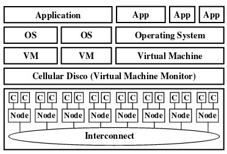
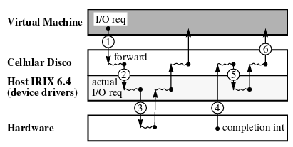

#

## Key ideas
* OSs not aware of difference between local or NUMA memory access
* Resource management policies not setup for large number of processors
* Use virtual machine monitor to run unmodified OSs on scalable multiprocessors
* VM monitor takes care of NUMA awareness

## Fault containment
* HW failures confined to a single cell of Cellular Disco

## Resource management
* Overcommittment of physical resources is fine and even encouraged
* Cellular disco assigns a fraction of these resources to each virtual machine depending on their needs
* Multiplexes physical processors among virtual machines

## Hardware virtualization
* Cells intercept privileged operations by VMs
* Virtual machine code runs in ring 1 - supervisor mode
* Cellular disco code runs in ring 0 - kernel mode
* pmap data structure maps virtual and physical addreses
* TLB flushes are avoided because Cellular Disco mantains a Software TLB per vCPU (L2TLB)

## Hardware faults containment
* A 1000 core processor cannot affor a reboot when 1 processor fails, it's too common of an event
* Only applications running in faulty processors will be lost
* Structure of multiple cells who contain complete copy of monitor text
and who manage pages belonging to its nodes allow for independent failures
* Cells also share memory for IPC

## Resource management under contrainsts
* Each machine processor maintains a run queue of vCPUs
* Load balancing via vCPU migration from one processor to another is good in
case of overloaded processors
* Each cell manages its own memory allocation
* Memory borrowing from other cells is OK when a cell is memory starved and others have free memory

## Support for large applications
* Large applications can bypass the OS and claim large shared memory regions
by directly interacting with the virtual machine monitor
* Cellular disco needs to make OS not page out these memory regions

## Prototype
* Dominant cost of overhead = kernel traps

