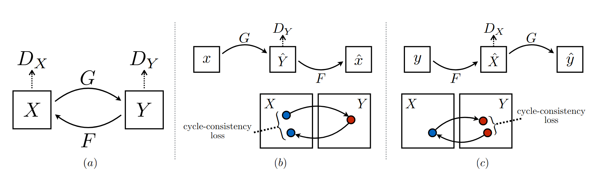
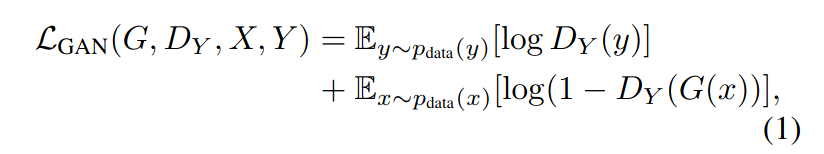
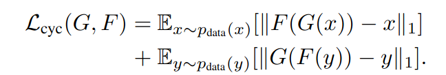
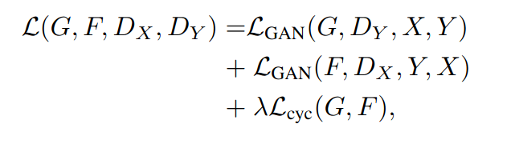

# [Unpaired Image-To-Image Translation using Cycle-Consistent Adversarial Networks](https://arxiv.org/pdf/1703.10593v7.pdf)

## Key ideas
* Learn mapping G: X -> Y such that the distribution of images X is indistinguishable from the distribution Y using adversarial loss.
* Couple with inverse mapping F: Y -> X  so that F(G(X)) ~= X

## Introduction
* Reason about stylistic differences between two images and imagine what the scene could look like if you were to translate it from one set into other
* Problem of image-to-image translation
* Obtaining paired data is difficult - we seek for translation between domains without paired data (e.g: horse <-> zebra)
* Train on cycle consistency loss:  F (G(x)) ≈ x and G(F (y)) ≈ y

## Related works
* GANs and adversarial loss
* pix2pix
* CoGAN for unpaired image to image translation
* Cycle consistency

## Formulation
* Adversarial loss: 
* Cycle Consistency loss: 
* Full objective: 

## Implementation
* Network architecture from Johnson et al., 3 convolutions, several residual blocks, 2 fractionally convolutions with stride 0.5,
* For the discriminator we use PatchGANs on 70x70 images
* Application to segmentation

