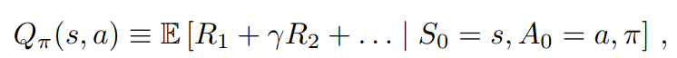
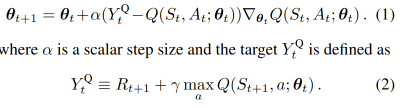
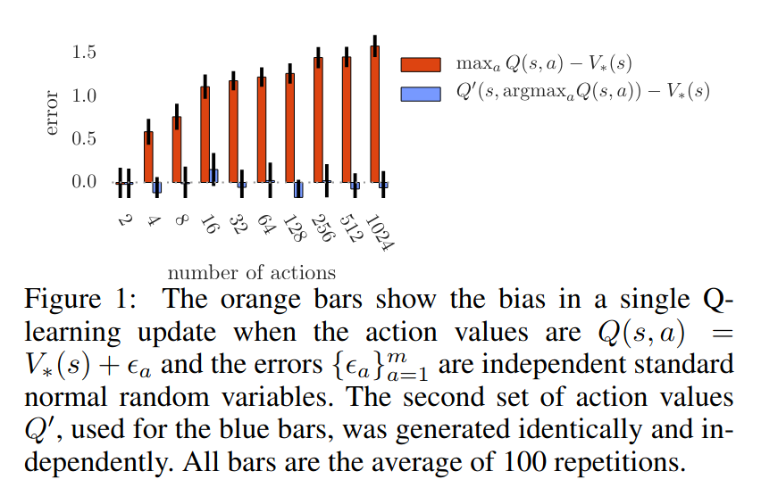
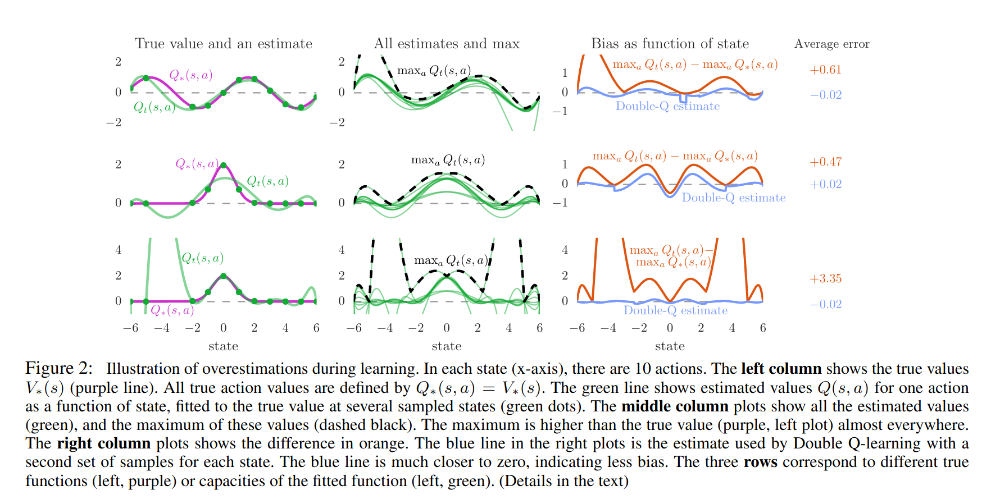
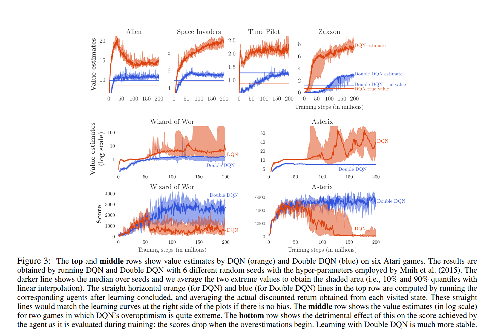

# [Deep Reinforcement Learning with Double-Q learning](https://arxiv.org/pdf/1509.06461v3.pdf)

## Key ideas
* It's been observed that DQN (from the Atari paper) overestimates some actions - but it wasn't know why. This paper proves why it happens.
* Specific adaptation to reduce overestimation and lead to much better performance

## Introduction
* The goal of RL is to learn a policy. During Sutton&Barto's work - certain actions were overestimated because there's a maximization step over certain action values.
* Previously overestimations were attributed to insufficiently flexible function approximation
* Unknown whether overestimations affect performance in practice
* To test it - test with DQN in a set of deterministic Atari 2600 games. Even in such a favorable scenario, overestimation happens.
* Show that the idea behind Double Q-Learning can be applied to do Double DQN and obtain accurately estimated actions in Atari, hence state of the art RL results

## Background
* To estimate the policy per state, action - we take into account the sum of expected rewards, where gamma is a discount factor for later rewards
* 
* To update, notice most problems will need a theta to consider specific timestamps
* 

## DQNs
* A Deep Q Network has an input of a state 's' and an output vector of action values for a certain theta timestamp, and state.
* Two important concepts are experience replay and the use of a target network
  - Target network is the same as the online network except its parameters are copied tau steps from the online networks

## Double Q-Learning
* The max operator in Q-Learning and DQN uses the same values to select and evaluate an action
* This is what makes it more likely to overestimate actions - being too optimistic that certain actions will perform well at all timesteps.
* In double Q-Learning two value functions are learned by assigning experience randomly to update one of the two value functions
* This way we learn in:
  - Set of weights theta: a greedy policy
  - Set of weights theta prime: evaluation of the greedy policy

## Overoptimism due to estimation errors
* Action values contain random errors uniformly distributed upon -epsilon, epsilon interval as shown in [Thrun, Schwartz (1993)](https://www.ri.cmu.edu/pub_files/pub1/thrun_sebastian_1993_1/thrun_sebastian_1993_1.pdf)
* Thrun and Schwartz gave an upper bound for these errors, however more interestingly - you can derive from that there's a lower bound of 0 (theorem 1 in the paper)
* Important: we do not need to even assume that estimation errors for different actions are independent
* 
* Overestimations indeed increase with the number of actions
* 

## Double DQN
* The idea is to reduce overestimation by decomposing the max operation into action selection and evaluation
* Proposal is to use the online network to evaluate the greedy policy, and to use the target network to estimate its value
* The only change is that the weights of the 2nd network theta_prime are replaced with the weights of the target network theta for the evaluation of the policy
* Evaluated on the Atari 2600 games testbed, which are high-dimensional and game mechanics change substantially between games.
* 
* Show that double DQN results are not only less overestimated but also much more stable over time
* The learning curves for double DQN are much closer to the line in blue representing the true value of the policy
