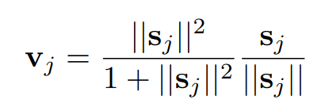
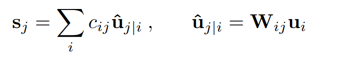
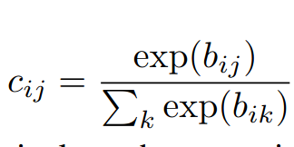
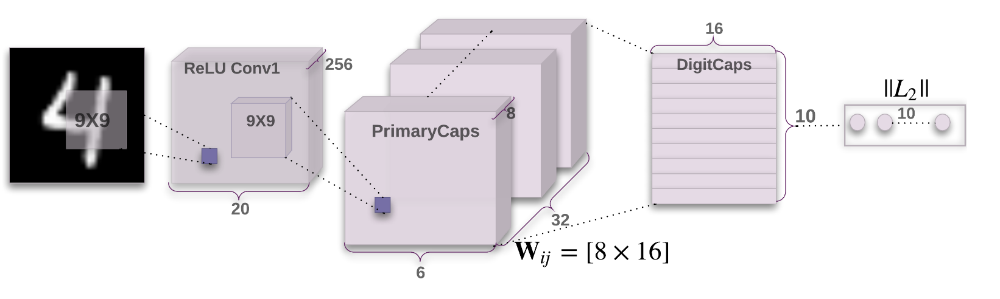
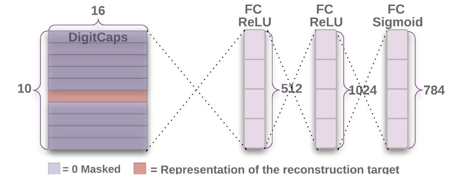
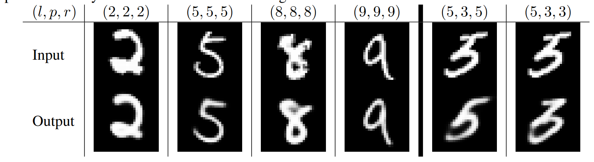

# [Dynamic Routing Between Capsules](https://arxiv.org/pdf/1710.09829v2.pdf)

## Key ideas
* Capsule: group of neurons whose activity vector represents a specific type of entity - particularly that entity exists and is oriented in a particular way
* When multiple predictions agree - a higher level capsule becomes active
* Proven to be at least state of the art level for MNIST and particularly good with overlapping digits

## Introduction
* Human vision ignores irrelevant details by only processing part of the optic array at the highest resolution
* Assume that single fixation gives more than "identified object and properties" but instead gives a sort of parse tree
* Each layer of the NN will be divided into many small groups of neurons called "Capsules"
* Each active capsule will choose a capsule in teh layer above to be its parent in the tree
* Activities within a capsule represent parameters such as pose,velocity, hue, texture...

## How the vector inputs and outputs of a capsule are computed
* Goal: length of the output vector to represent the probability that entity represented by the capsule is present in the input
* Need for squashing function.
* W: weight matrix. u: prediction vector of capsule in the layer below, s: input to a capsule (except for the 1st layer)
* c: coupling coefficients for routing neurons to capsules determined by "iterative dynamic routing process"



* The agreement is simply the scalar product a = v * u
* Pseudocode:
```
def routing(u, r, layer):
  for capsule in layer[l]:
    for capsule in layer[l+1]:
       b[i][j] = 0

  for iteration in range(r):
    for capsule i in layer l: c[i] = softmax(b[i])
    for capsule j in layer l+1: s[j] = sum(c[i][j] * u[j][i])
    for capsule j in layer l+1: v[j] = squash(s[j])
    for capsule i in layer l and capsule j in layer l+1: b[i][j] = b[i][j] + u[j][i] * v[j]
```

## CapsNet architecture
* 2 conv layers + 1 FC layer
* 256 9x9 conv kernels stride 1 + ReLu: converts pixel intensities to local feature detectors -> inputs to primary capsules
* Primary capsules are the lowest level of multi-dimensional entities.


* Euclidiean distance between image and output of sigmoid layer is meant to be minimized during training
* During training we mask out all but the activity vector of the correct digit capsule
  - Then the output of the digit capsule is fed to the decoder to model the pixel intensities. We minimize the sum of squared errors between the outputs of the logistic units and pixel intensities.


## Capsules on MNIST
* 28x28 MNIST images shifted up 2 pixels with 0 padding - no more augmentation
* 99.23% MNIST accuracy but 79% on a MNIST + Affine transformations

## Segmenting highly overlapping digits
* Dynamic routing is similar to attention mechanisms: 1 capsule can attend to active capsules at the level below and ignore others
* This should help recognize multiple objects in the image even if objects overlap

## Discussion and previous work
* For 30 years, state of the art in speech recognition was hidden Markov models + Gaussian mixtures as output distributions
* One-of-n representations are exponentially inefficient compared with RNN
* CNNs might have exponential inefficiencies: such as dealing with affine transformations
  - Alternatives are increasing the size of the training set in an exponential way
  - Or replicating feature detectors on a grid that grows exponentially
  - Possibly, Capsules avoid these inefficiencies by converting pixel intensities into vectores of recognized fragments.
* Capsules make strong representational assumption: at each location, there's at most one instance of the type of entity  the capsule represents
