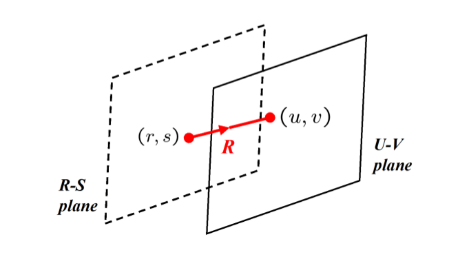
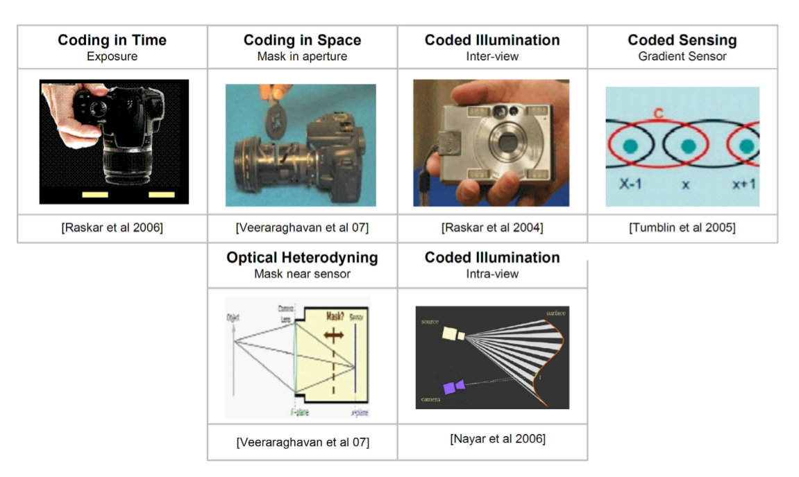

#

## Key ideas
* Recording scenes as multiple sequential images with epsilon variations of the camera parameters
* Reconstruct final images from these observations
* Final image may look distorted to a human observer but it allows to decode valuable information about a scene

## Examples
* Coded exposure: for preserving fast-moving objects info
* Coded aperture optical heterodyning: to record 4D of light and achieve digital refocusing
* Coded illumination: to recover depth info by using multiple flashes with a silhouette
* Coded sensitivity:  to record changes in intensity of pixels to produce HDR

## Light field
* The plenoptic function defines the ray of light in 3 spatial coordinates and 2 angles
* Using 2 points on 2 plane (r, s), (u, v) can represent any flow of light through an empty region of the space
* Since radiance is constant the photic field is 4 dimensional
* 4D reflectance field - the reflectance distribution in an opaque surface

## What is CP?
* Making scenes more machine readable
* Overcoming limitations of digital photography like depth, resolution...
* Enables photos captured with more than one camera in more than one moment or angle

## Elements
* Generalized optics: 4D ray bender that modifies a light field, less-less modification possible
* Generalized sensors: go beyond 2D capture of the scene and capture a 3D ray representation
* Generalized reconstruction: converstion of raw output into pixels, removing noise, dead pixelsxels, etc...
* Computational illumination: capture what you want to reveal in a scene programmatically

## Epsilon photography
* Record scene via multiple images with epsilon variation on camera parameters (aperture, exposition, focus, movement...)
* Merged pic retains the best aspects of each, field of view , dynamic range, depth of field, spatial resolution...

## Coded exposure
* Avoid motion blur caused by moving cameras or objects
* Flutter the shutter open and closed during a coded exposure time
* The flutter changes the traditional box filter into a broadband filter to decode details of the blurred image

## Coded aperture and optical heterodyning
* We use a pattern alternated mask to encode the light field entering the camera
* Modulation of the light field possible
* Focus at different depths via computational techniques

## HDR with a gradient camera
* Capture multiple images with different exposures and merge them to obtain higher fidelity image
* Also feasible with sensors of mulitple (codeable) sensitivies for each cell
