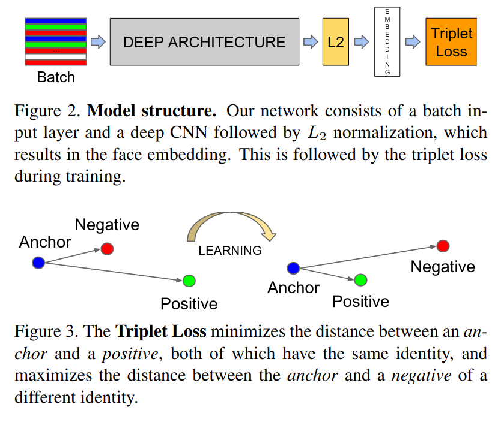
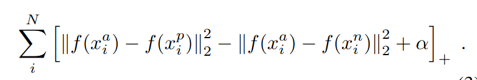

# [FaceNet: A Unified Embedding for Face Recognition and Clustering](https://arxiv.org/pdf/1503.03832v3.pdf)

## Key ideas
* Learn mapping from face images to compact Euclidean space where squared L2 distances directly correspond to face similarity
* Once space has been created, it's not difficult to do recognition, verification, clustering with Face embeddings
* CNN to optimize the embedding
* Triplets of roughly aligned matching/non-matching face patches generated a novel online mining method

## Introduction
* Mapping into Euclidean space
* Recognition: kNN classification problem
* Clustering: K-means or agglomerative clustering

## Related work
* Purely data driven methods to learn from pixels in the image
* Zeiler&Fergus model: consists on interleaved layers of convolutions, non-linear activations, normalizations, max-pool layers
* Inception model: similar to above
* Zheyao: 1st warp faces into canonical frontal view then learn CNN that classifies the images.
* Taigman: aligns faces to 3D model. Siamese network to optimize L1 distance between two face features

## Method

* Strive for embedding f(x) that minimizes the squared distance between all faces of the same identity and maximizes the squared distance of faces of different identities
* Minimize loss:

* Critical to choose triplets that violate the triplet constraint for training
* Infeasible to compute distances for the whole set, alternatives:
  - Generate triplets offline every n steps from checkpoint
  - Generate triplets online from the mini-batch
* Tried LeNet vs Zeiler&Fergus CNNs

## Summary
* Provide a euclidean space for face verification, this sets it apart vs other methods that use CNNs, PCA or SVMs
* Requires minimal alignment (cropping)
