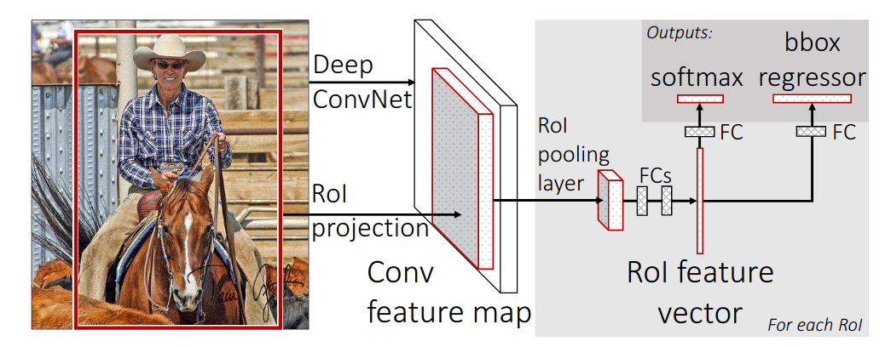

# [Fast R-CNN](https://www.cv-foundation.org/openaccess/content_iccv_2015/papers/Girshick_Fast_R-CNN_ICCV_2015_paper.pdf)

## Key ideas
* Trains VGG16 9x faster than RCNN, tests 213x faster and achieves higher mAP

## Introduction
* Compared to image classification, object detection is a harder problem to solve
* Numerous candidate locations (region proposals) must be processed.
* Region proposals must also be fine-tuned to provide precise localization
* R-CNN has drawbacks:
  - Training is a multi-stage pipeline (1. fine-tunes CNN to object proposals, 2. SVM to CNN features, 3. bounding-box regressors)
  - Training is expensive in space and time
  - Object detection is slow (47s)
* Fast R-CNN fixes them:
  - Higher mAP
  - Single-stage training with multi-task loss
  - Update all network layers
  - No disk storage needed for feature caching

## Architecture and training
* RoI - regions of interest pooling layer uses max-pooling to convert the features in a RoI into a feature map

* Initialize from pre-trained networks for ImageNet:
  - 1st the last max-pooling layer is replaced by RoI layer
  - 2nd the last FC layer and softmax are replaced with 2 sibling layers, a FC layer and a softmax over K+1 categories and category-specific bounding boxes
  - 3rd the input now should take both a list of images and a list of RoI in those images
* Efficient training in which SGD mini-batches are sampled hierarchically, first sampling N images, then R/N RoIs from each image
* Multi-task loss:
  - 1st output layer is a discrete probability distribution per RoI over K categories
  - 2nd output layer is bounding box regression offsets
  - Each training RoI is labeled with 1 ground truth class and 1 ground truth regression bounding-box target

## Detection
* Running a forward pass through a image pyramid and RoI list.
* Nearly 1/2 of the time is spent on computing the FC layers instead of the CNN
*
