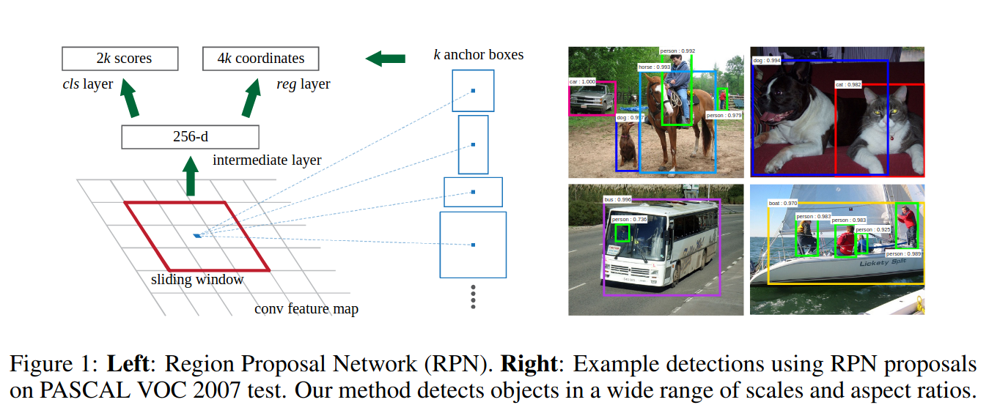
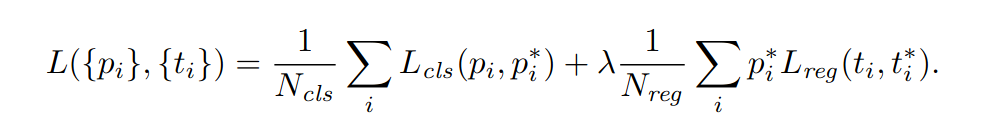

# [Faster R-CNN](https://proceedings.neurips.cc/paper/2015/file/14bfa6bb14875e45bba028a21ed38046-Paper.pdf)

## Key ideas
* Advance toward RPN - region proposal networks - for even faster R-CNN object detection

## Introduction
* Since Fast R-CNN, multi-stage loss allows for very fast training and detection, however ignoring the time spent on making region proposals
* Region proposals are the bottleneck in object detection systems now
* Typically, Selective Search (SS) was used for finding these. It's a method implemented in a CPU, which doesn't take advantage of GPUs
* Computing proposals with a NN is much more efficient and can take more inputs into account
* To unify training RPN and Fast R-CNN we propose a system that alternates fine-tuning the region and fine-tuning the object detection

## Region Proposal Networks (RPN)
* Input: image, output: set of rectangles with "objectness score".
* Assume that there are a set of convolutional layers that can be shared between RPN and Fast R-CNN

* Vector is fed into box-regression and box-classification layers
* Translation invariant anchors
* Loss function: highest IoU with ground truth box, if 0.7 or more, +1, if 0.3 or lower, -1

## Sharing convolutional features between RPN and Fast R-CNN
* It's not as easy as defining one network that includes both RPN and Fast R-CNN and training it with backprop
* The reason is that Fast R-CNN is meant to learn with fixed object proposals and it's not clear if it'd learn while changing the proposals simultaneously
* Steps:
  - Train RPN with ImageNet fine-tuned for region proposals
  - Train Fast RCNN with proposals in step 1
  - Use detector network to initialize RPN training but fix the shared conv layers and only fine-tune layers unique to RPN
  - Fine tune the FC layers of the fast R-CNN
