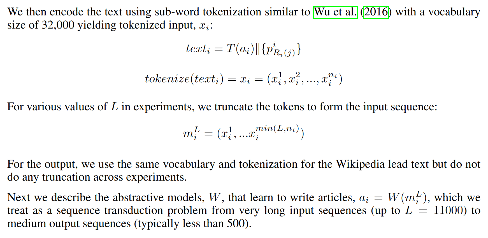
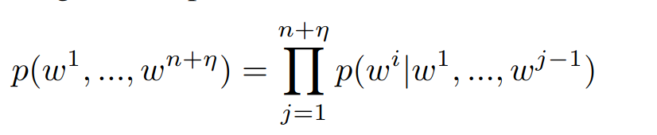
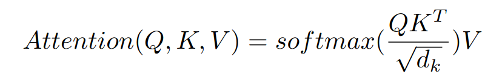
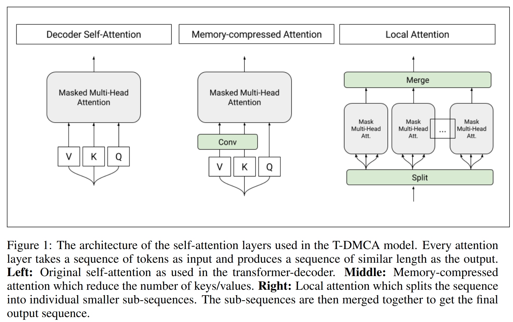

# [Generating Wikipedia by summarizing long sequences](https://arxiv.org/abs/1801.10198%0A)

## Key ideas
* Generating Wikipedia can be approached as multi-document summarization of source documents

## Introduction
* Sequence to sequence has success in NLP tasks such as seq. transduction tasks like machine translation.
* Prior work allows to summarize news articles using input from the 1st sentence of a text to the whole article
* This requires a significant number of parallel text to summary pairs as understanding is key to generate accurate summaries.
* Input: wikipedia topic, and a collection of non-Wikipedia reference documents
* Output: wikipedia article text
* Only decoder instead of encoder-decoder: it performs better on longer sequences

## Related works
* Other datasets: Gigaword corpus used to construct news articles from a number of publishers
  - Task is more akin to paraphrasing than summarization
  - Only the 1st sentence is used to predict the headline: RNN-based encoder with attention (seq2seq) works well
* Other similar tasks: abstractive summarization by checking question & answering dataset
* Sauper & Barzilay(2009) has a similar task of summarizing articles but these are generated extractively from articles found by querying in search engines using the Wikipedia topic

## English Wikipedia as multi-document summarization dataset
* Only articles with 1 crawlable citation at least are extracted
* 1. Cited sources: any Wikipedia article that conforms to style guidelines should contain citations in the References section. All text without markup is imported from those citations
* 2. Web Search results: collect the top 10 result pages from Google, using the article titles as queries. Removing clones and the Wikipedia article itself.

## Methods and models
* Because of the huge amount of text, training is infeasible due to HW constraints, so we only choose a subset of it.
* In the 2nd step, we generate an abstract model based on the highlights
* Extractive stage, for each article create a ranked list of paragraphs, from which we select the first L tokens:
  - Identity: baseline, choose the first L tokens
  - tf-idf: rank paragraphs using their tf-idf for the query (title of article) with respect to the document
  - TextRank: weighted graph where text units are nodes and edges are defined by similarity between word overlap
  - SumBasic: frequencies of words in text are used to get a score per word, and thus a score per paragraph. After selecting the best scoring sentence, words in it have their scores reduced, repeat until you get the desired summary length
* Abstractive stage:

* Baseline model: seq2seq-att
* Transformer decoder:

* Transformer decoder with attention:

