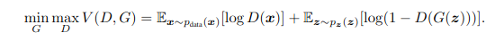
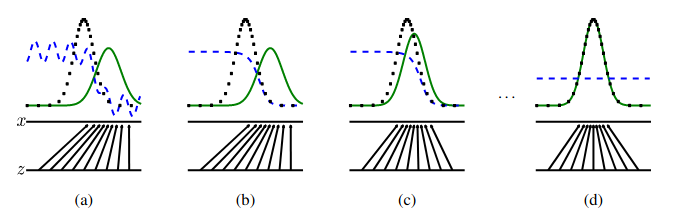
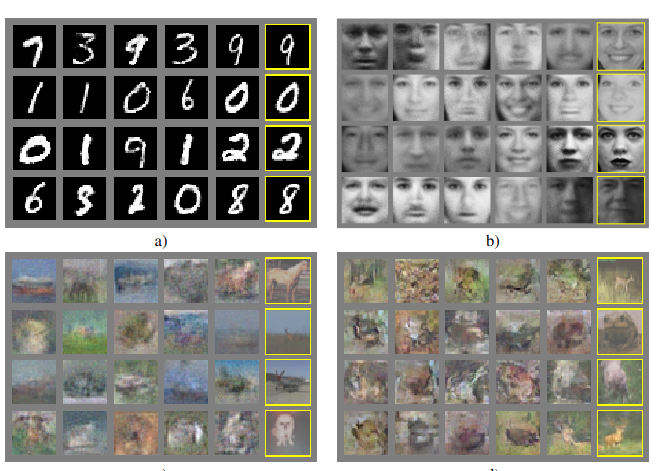

# [Generative Adversarial Networks](https://paperswithcode.com/paper/generative-adversarial-networks)

## Key ideas
* Framework for estimating generative models via adversarial process
* G (generative) model: captures the data distribution
* D (discriminative) model: estimates the probability that a sample came from training data instead of G
* Training for G consists in maximizing its probability of D making a mistake
* Global minima is guaranteed to be D always returning 0.5 for a G that represents the training data distribution perfectly

## Introduction
* Most historical successes have happened involved discriminative models, mapping high dimensions to a class label
* Generative models have been historically less impactful as it's been difficult to leverage linear units in the generative context

## Related work
* Markov chain Monte Carlo menthods (MCMC)
* Deep belief networks (DBN)
* Score matching or noise contrastive estimation

## Adversarial nets

* p_g is the generator distribution
* p_z is the prior on input noise variables
* G is a differentiable function represented by a multilayer perceptron with parameters theta_g
* Aim is to maximize D assigning the proper label, and G minimizing log (1-D(G(z)))

* D is blue, dashed
* G is green, solid
* Data is black dotted
* Goal is to get to a point where D=1/2 for any value of G, where G matches perfectly the data

## Proof of theoretical minima
## Experiments

* Generator: mixture of ReLU & Sigmoid
* Discriminator: maxout activations + dropout
* Noise only applied to the bottommost layer, even if theoretically it would work in intermediate layers too
* KDE to estimate probability of test data under p_g

## Advantages and disadvantages
* No explicit representation of p_g(x)
* D must be syncronized with G during training
* Markov chains are never needed
* No inference needed during learning

## Future work
* p(x|c) conditional generative models could follow
* Learned approximate inference to predict noise (z) given x could follow
* Efficiency improvements for training such as devising better initial z distributions to sample from

