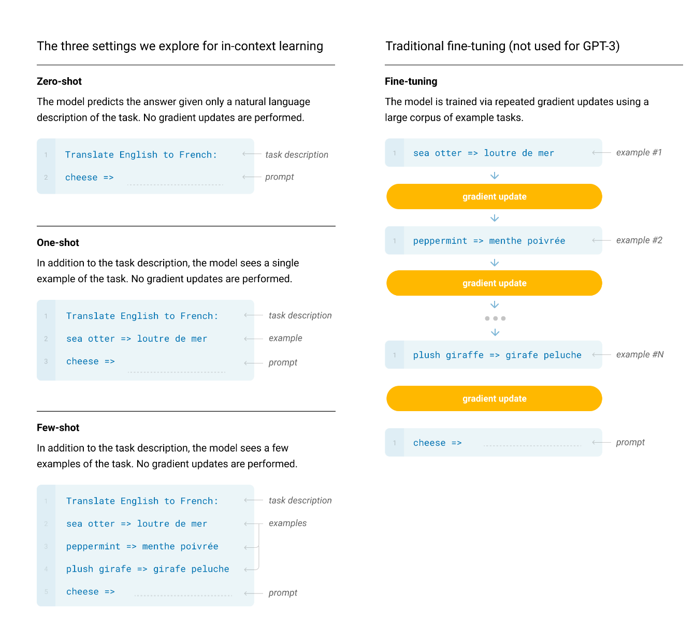

# [Language Models are Few Shot Learners](https://arxiv.org/pdf/2005.14165v4.pdf)

## Key ideas
* Recent advancements (BERT) show that pre-traning + fine-tuning to specific tasks is successful
* Still, this method requires fine-tuning to tasks with 10000s of examples
* Humans can perform a new language task with a few examples or simple instructions, they don't need 1000s of examples
* GPT-3 with 175B parameters: autoregressive language model, able to learn with few-shot training

## Introduction
* Major limitation remains that you need to fine-tune the model to specific tasks, and some tasks might not have datasets to train with
* Potential to exploit spurious correlation between tasks
* Apparently a huge number of parameters allows models to develop a sort of meta-learning, pattern recognition

## Approach
* Few-shot: a few demonstrations of the task at inference time are given, but no weights updates are allowed. Typically between 10 and 100 examples are provided
* Results for few-shot happen to be much worse than state-of-the-art fine tuned models.

* Same model as GPT-2
* Evaluation: draw K examples from a task test's set and test them
