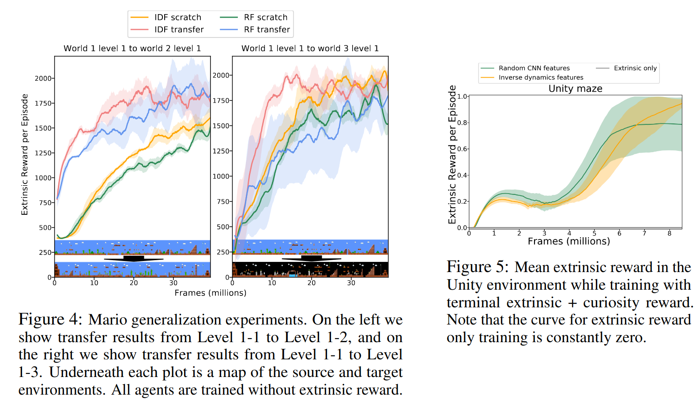

# [Large-Scale Study of Curiosity-Driven Learning](https://arxiv.org/pdf/1808.04355v1.pdf)

## Key ideas
* RL relies on carefully engineering a policy with rewards extrinsic to the agent
* How to model curiosity: a type of intrinsic reward function which uses prediction error as a reward signal
* First large-scale study of curiosity driven learning: *without any extrinsic rewards*

## Introduction
* Examples of intrinsic rewards include "Curiosity" or "visitation counts" (discouraging the agent to revisit the same state too many times)
* Idea is that intrinsic rewards will bridge the gaps between sparse extrinsic rewards
* How to deal with scenarios with no extrinsic reward at all?
  - Like babies: employ goal-less exploration to learn skills that will be useful in life later on
  - Minecraft
  - Visiting your local zoo
  - We tested in 54 environments: videogames, physics engine simulations, 3D navigation tasks
* Predicting future state in high dimensional raw observation space is a challennging problem
  - Learning dynamics in an auxiliary space leads to improved results

## Dynamics-based Curiosity-driven Learning
* Observations: x, actions: a, transitions to state x_t+1, rewards: r,
* We want to provide a reward based on how informative the transition was
* Exploration bonus:
  - Embed observations into representations
  - Forward dynamics network to predict representation of the next state
* Exploration reward defined as: r_t = -log(p(fi(xt_1) given x_t, a_t))
  - Also called the surprisal
* Feature spaces for forward dynamics:
  - Should be compact, low dimensional, filter irrelevant parts of the observation space
  - Sufficient: contain all of the important information
  - Stable: non-stationary rewards make it difficult to learn. The forward dynamics model evolves over time which intrinsically make this function unstable but we will try to minimize it
* Efficacy of few methods:
  - Pixels: sufficient and stable, but too high-dimensional
  - Random features: we take our embedding network and fix it after random initialization: features are compact but not sufficient
  - Variational Autoencoders (VAE): inference network q(z|x) which models the world with noise
  - Inverse Dynamic Features (IDF): given a transition, the inverse dynamics task is to predict the action given the states. features might not be sufficient

## Practical considerations in traning an agent driven purely by curiosity
* PPO for learning
* Reward normalization (dividing the rewards by a running estimate of the stddev of the sum of discounted rewards)
* Advantage normalization
* Observaiton normalization
* More actors - more actors might learn a policy in parallel

## 'Death is not the end' - discounted curiosity with infinite horizon
* In a game environment, a game over or 'done' signal can leak too much info about the true reward function
* If you don't remove this signal, a simple strategy of trying to keep the agent alive (+1 if agent is alive in a certain timestep and -1 on death) is enough to create a good policy
* Death should become another transition to the agent - to be avoided only if it's boring

## Experiments
* Both policy and embedded network work directly from pixels
* Curiosity-driven without extrinsic rewards
  - In Atari games, we measured how extrinsic rewards performed (only evaluated them, but didn't use them for training)
  - Just with intrinsic rewards: extrinsic evaluation also went up, in some cases with scores comparable to learning with directly extrinsic rewards
  - Might be because game designers are good at guiding the players to finish the game:
     - e.g: in Breakout, the more bricks you destroy, the more interesting the patterns become, making the bot curious just to see what is new and what is not new

## Generalization across novel levels in Super Mario Bros
* To test this, we pre-train the agent using curiosity only on Mario Bros 1-1
* Moving 1-1 to 1-2 generalizes well. However, 1-2 has a darker blue background, which makes it generalize worse.

* RF seems to transfer more weakly than IDF-learned features

## Curiosity with sparse external reward
* E.g: a maze, where the only reward is knowing you have found the exit.
* Trained on a maze in Unity 3D with 9 rooms

