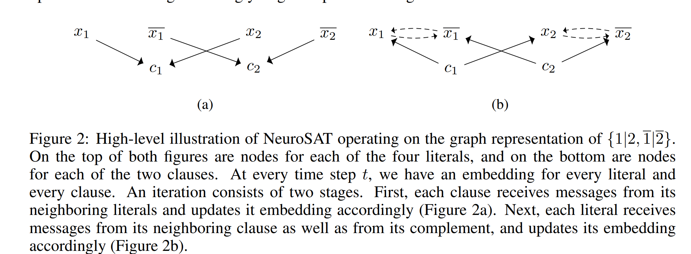
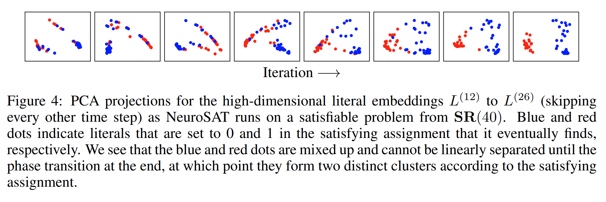

# [Learning a SAT solver from single-bit supervision](https://arxiv.org/pdf/1802.03685v4.pdf)

## Key ideas
* NN trained as a classifier to predict satisfiability can be used to solve SAT problems
* Generalizes to novel distributions

## Introduction
* SAT problem is NP-complete. Searching for any kind of efficiently-checkable certificate in any context can be reduced to a SAT formula.
* In practice the problem comes up in hardware verification, test pattern generation, scheduling, etc...
* Modern SAT solvers based on backtracking solve these extremely well with millions of variables
* 1 bit of supervision to say satisfiabile or not. Solution can be decoded from the neural activations

## Problem setup
* (x1 v x2 v x3) ∧ ¬(x1 ∧ x2 ∧ x3)  is satisfiable as you can evaluate to 1 as long as x1, x2 and x3 are not the same
* Formulas need to be drilled down to CNF

## Model
* NeuroSAT needs to encode both permutation invariance and negation invariance
* Graph problem with a node per clause, node per literal, edge between literal and clause

* To force the network to learn, we create a distribution SR(n) over pairs of SAT problems where 1 is satisfiable and 1 is not.

## Decoding satisfying assignments

