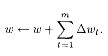
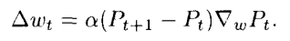
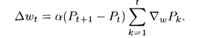
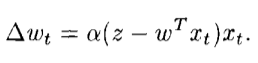
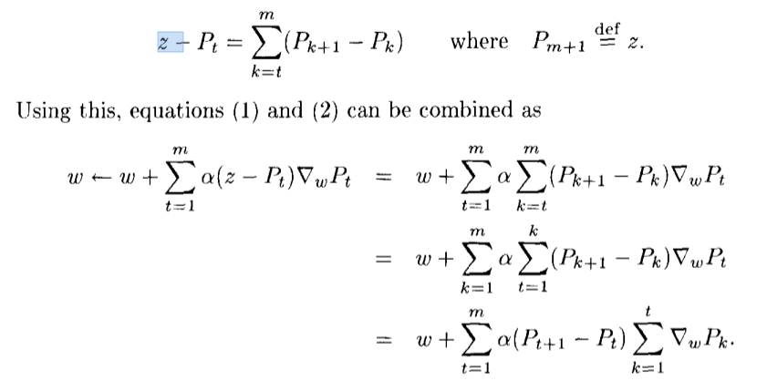
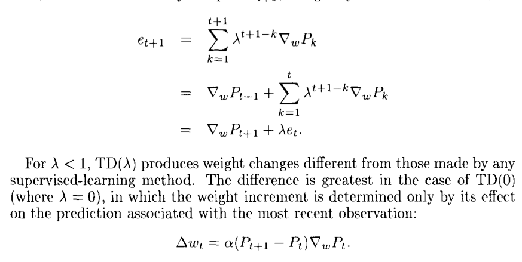

# [Learning to predict by the methods of temporal differences (Sutton 1988)](https://pdfs.semanticscholar.org/9c06/865e912788a6a51470724e087853d7269195.pdf)

## Key ideas
* Use past experience of incompletely known system to predict the future
* Assign credit by doing successive predictions and calculating differences
* Good for pattern-recognition problems
* Iterative, low-cost alternative to supervised learning, proven equally effective or better

## Temporal-difference and supervised learning approaches
* In supervised learning (historically more popular)
  * Learner learns to associate pairs (input -> expected output)

## Single vs multi step prediction
* Single: all information about correctness is revealed at once (e.g: weather)
* Multi: correctness is revealed several steps after having to predict (e.g: chess moves)
* Real world solvable problems tend to be multi-step

## Computational improvements
* Each x_t is a vector <observation, outcome>
* Experience comes in x_1, x_2, ... x_t, z vectors
  * x_t is a real scalar at time t for each position
  * z is the outcome of the sequence
* The learner produces P_0, P_1, P_t predictions trying to estimate z
  * Predictions use weights 'w'
* w is updated as part of the learning process, iteratively

* Usually the update procedure for delta_w in supervised learning is:

### The problem
* All delta_wt depend on 'z' which is only known at the end of the sequence.
* All Pt must be saved in memory

### TD lambda
* TD allows to compute delta_wt without z:
  * z - Pt (prediction error) is represented as a sum
  * 
  * This can be computed at every step, no need to remember P_1..Pt, and this distributes time complexity over 0..t

* If P_t is a linear function of x_t and w, the equation is equal to the Widrow-Hoff rule:
  * 
  * z-wt xt represents the error between prediction and reality (z)
  * xt multiplies the error, to determine weight changes
    * If error is positive, mutiplying by x_t will increase wx_t and therefore reduce the error

## Propagation
* P_t computed by network when it's not a linear function of x_tand w.
  * 
* Lambda is then used as a way to weigh "recency". E.g: TD(1) will do a one step look ahead, disregarding the rest, TD(0) will look infinitely far to compute the weights.
* 
* 

