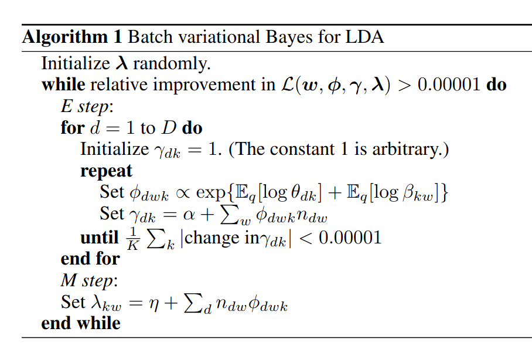
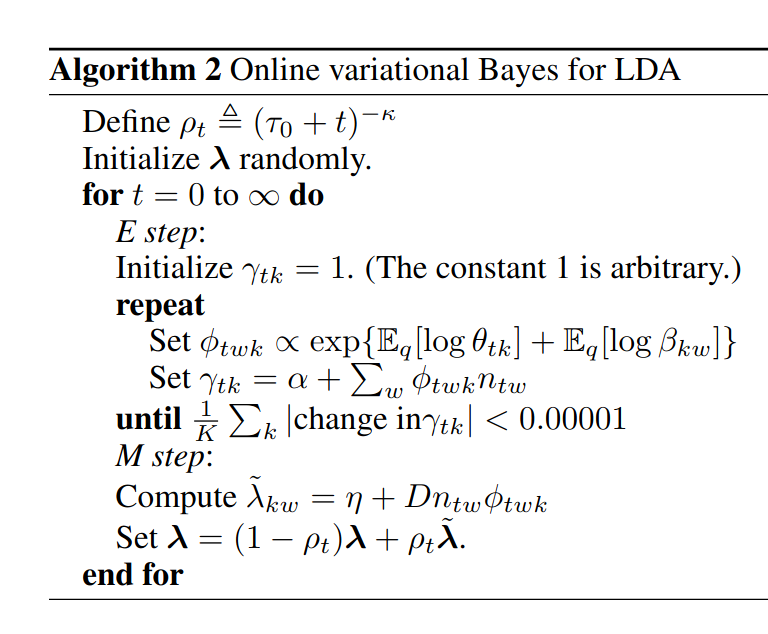

# [Online Learning for Latent Direchlet Allocation](https://proceedings.neurips.cc/paper/2010/file/71f6278d140af599e06ad9bf1ba03cb0-Paper.pdf)

## Key ideas
* Online variational Bayes algorithm for training LDA
* Stochastic optimization with natural gradient step
* Studied fitting 100-topic model to 3.3M articles from Wikipedia

## Introduction
* Hierarchical Bayesian modeling has become a mainstay
* Bayesian models encode assumptions about observed data and analysis proceeds upon exploring posterior distribution of model parameters
* For topic modeling, the posterior is intractable so many researchers just approximate it through sampling or approximation approaches
  - Sampling: Markov Chain Monte Carlo
  - Optimization: Variational Bayes

## Online variational Bayes for LDA
* Assumes a collection of K topics, where each topic has a multinomial distribution over the vocabulary, which is assumed to have been drawn from a Direchlet distribution
* Generative process for LDA:
  - 1. Draw a distribution over topics theta_d - Direchlet(alpha)
  - 2. For each word in the document, draw a topic index from the topic weights and draw the observeed word from each topic
  - 3. Sum all of the topic assignments z: result is that we have the probability of a word being in a certain topic
* Think of LDA as a factorization of the matrix of word counts n into a matrix of topic weights theta and a dictionary of topics beta

## Batch variational Bayes

## Online variational inference for LDA
* Empirically collapses faster than batch collapsed Gibbs sampling
* Algorithm 1 requires 1 pass through the corpus on each iteration
* Propose online variational inference algorithm for fitting lambda: the parameters for the variational posterior over the topic distributions beta

