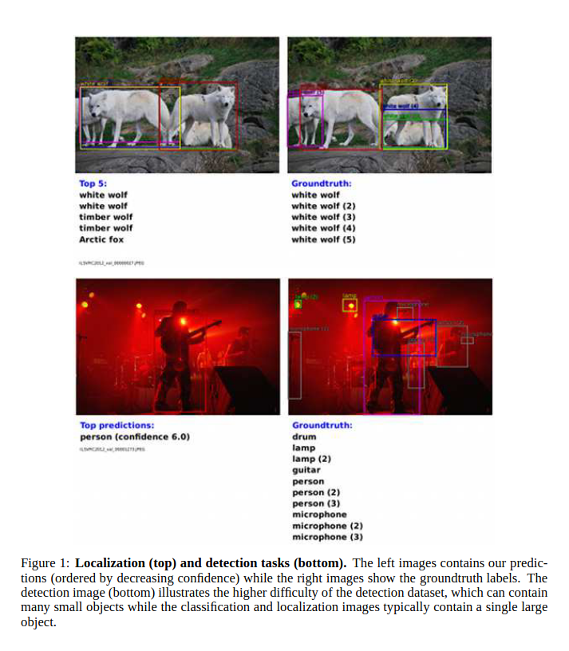
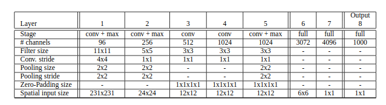
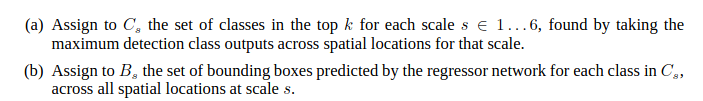
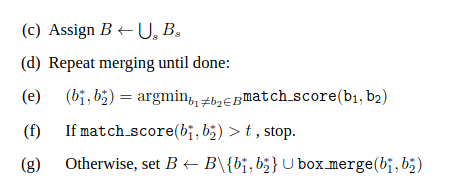

# [OverFeat: Integrated Recognition, Localization and Detection using Convolutional Networks](https://arxiv.org/pdf/1312.6229.pdf)

## Key ideas
* Multiscale and sliding window can be implemented within a ConvNet
* Learning to predict object boundaries
* Bounding boxes are then accumulated instead of supressed to increase confidence
* Winner or ILSVRC2013 and obtained competitive results for detection and classification
* Feature extractor from OverFeat

## Introduction
* Main advantage of CNN is that you train from raw pixels to ultimate categories: thereby alleviating the requirement to design feature extractors
* Main disadvantage of CNN is that you need a lot of labeled training samples
* Point of the paper: show that training CNN to classify, locate and detect objects can boost the accuracy of all 3
* While ImageNet usually has the main object roughly centered, objects of interest may vary in size and position
  - Address this with CNN + sliding window over multiple scales - however many windows contain an identifiable portion of object but not the whole object
  - Instead of producing distribution of categories for each ewindow, produce a prediction of location and size of bounding boxes
* Other autors proposed to classify the central pixel, then categorize using the window as context for the decision

* Order of difficulty: classification < localization < detection

## Classification
* Similar to best ILSVRC12 by Krizhevsky et al
* Fixed input size during training, smallest dimension is 256 pixels
* Extract 5 random crops and horizontal flips of size 221x221, present them in mini-batches of size 128

* Feature extractor: OverFeat to provide powerful features for computer vision research. Fast and accurate model provided.
* Multi-view voting to boost performance: Fixed set of 10 views (4 corners + center with horizontal flip) is averaged
  - While sliding window might be prohibitive for certain types of models, for CNN it's efficient
  - Output will be a spatial map of C dimensional vectors at each scale
* Why are sliding windows eficient for CNNs? Because they naturally share computations common to overlapping regionso

## Localization
* Replace classification layers by regression network
* Simultaneously run classifier and regression networks across all locations and scales, since the feature extractor layers are the same, only the final FC layers have to be recomputed
* Input to regression network: pooled feature maps from layer 5, 2 FC layers of 4096 and 1024, final output layer of 4 units for BBox edges coordinates
* Combining predictions by greedy merge strategies

* max_score is computed with the sum of the distance between centers of the two bounding boxes and intersection area of the boxes

## Detection
* Similar to classification training but in a spatial manner
