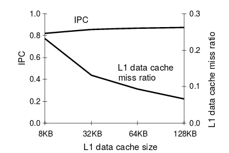
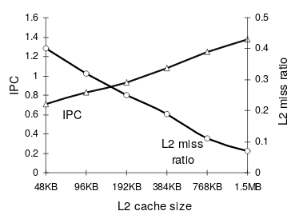

#[Performance of multithreaded chip multiprocessors and implications for operating systems design](http://www.eecs.harvard.edu/margo/papers/usenix05/paper.pdf)

## Key ideas
* L2 is the most critical shared resource in this architecture
* Scheduler being L2-concious can improve instructions per cycle and reduce miss ratio

## Bottlenecks
* L1 cache misses largely fixed by hardware multithreading
* L2 performance limitedly improved by hardware multithreading
* Instruction per cycle are very degradated when L2 is small

## Balance-set scheduling
* Separate all runnable threads into subsets so that:
  * workingSetSize(subset) < L2 cache size
* Schedule 1 subset at a time to reduce miss ratios

## Improvement over balance-set
* Take into account threads working set locality to guess miss ratio of subsets
* Only schedule subsets of threads below certain threshold
* Performance gains of 27-45% and cache miss ratio reduced by 25-37%

