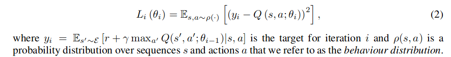
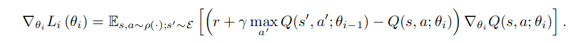
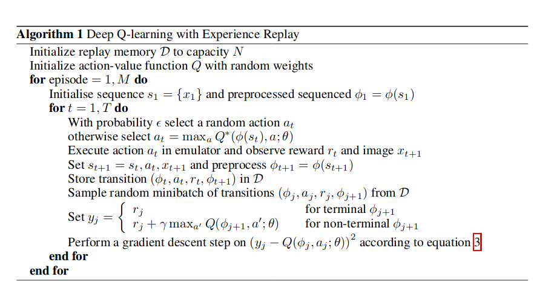

#[Playing Atari with Deep Reinforcement Learning](https://www.cs.toronto.edu/~vmnih/docs/dqn.pdf)

## Key ideas

* Train neural networks (convolutional, as function approximations) with Q-learning
* Simple input: raw pixels (simplified to grayscale)
* Simple output: value function estimating rewards from state

## Introduction

* Problem in RL: performance of learning relies on input quality (good images, etc..)
* How to improve learning when the reward of an action is known only 1000s of timesteps away
  * Supervised learning is terrible at this
* Train network with Q-learning + stochastic gradient descent to update the weights
* Use experience replay mechanism using random previous transitions to smooth the training distribution
* Train 1 NN to be able to solve all of the Atari 2600 games

## Background

* Observe state x_t belonging to R^dimensions -> take action -> get reward r_t
* state s_t = x_t, a_1, x_2, ... , a_t-1, x_t gives rise to a MDP where each sequence is a state.
* Q*(s,a)  returns the maximum action achievable after seeing a sequence 's' and taking the action 'a'
* Q* follows the Bellman equation, intuition:
  * If the optional value Q*(s',a') is known for all possible actions
  * The optimal strategy is to take a' to maximize 'r + gamma * Q*(s', a')'
* Use a function approximation to Q: non-linear, using NN.
  * This is necessary because the state space for these games is huge

## Q-network training
* Network training to minimize loss functions
* 
* Optimize the loss by stochastic gradient descent:
* 

## Related work
* In contrast to TD-gammon, we use experience replay.
* e_t = (s_t, a_t, r_t, s_t+1) used to update the weights after every episode
* 
* Randomized learning from samples > learning over consecutive samples
* Prioritizing some experience over other isn't bad, but prioritizing high-rewards can get you in a loop
  * Prioritized experience learning paper contains more info about how to prioritize by choosing samples that "teach the most"
