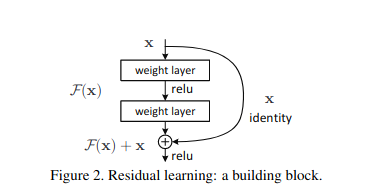

# [Deep Residual Learning for Image Recognition](https://arxiv.org/pdf/1512.03385v1.pdf)

## Key ideas
* Residual learning framework allows to train deeper networks
* Empirical evidence that residual networks are easier to optimize and gain accuracy from increased depth
* Solely due to extremely deep representation, improvements of nearly 30% are seen in COCO

## Introduction
* An obstacle to exploring this deeper networks is vanishing/exploding gradients - which hamper convergence
* Possibility of addressing this with normalized initialization and intermediate normalization
* It's been observed that when deeper networks start converging, they reach a saturation point and then degrade rapidly
  - Such degradation is not caused by overfitting
  - Even adding more layers causes higher training error
- 
* Expected to have shortcut connections that skip one or more layers to perform identity mapping
* H(x) = F(x) + x
* F(x) is whatever makes the output different from the input (that's why we sum the x identity)
* Extremely good ImageNet and CIFAR-10 results with deep networks but less complex than VGG

## Related work
* Residual representations explored in VLAD
* Multigrid method for partial differential equations
* Shortcut connections were explored in previous papers before

## Deep Residual Learning
* If one can hypothesize that multiple nonlinear layer can asymptotically approximate complicated functions F(x):
  - This is equivalent to hypothesize that they can approximate the residual functions H(x) - x
  - The original function then becomes H(x) = F(x) + x
* This reformulation is motivated by the degradation problem mentioned in the introduction
* Building block:
  - y = F(x, {Wi}) + x
  - The shortcuts don't introduce additional complexity and allow us to compare residual networks really easily
  - The form of the F function is flexible, it could have multiple layers

## Network architectures
* Plain network
  - Inspired by VGG nets
  - 3x3 filters
* Residual network
  - Shortcut connections to turn the plain network into counterpat residual version
* Implementation for imagenet
  - 224x224 crops randomly sampled and horizontal flipping with per-pixel mean subtracted like AlexNet
  - Batch normalization after each convolution and before activation
  - No dropout
  - Other params: Improving neural networks by preventing co-adaptation of feature detectors. arXiv:1207.0580, 2012

## Experiments (skipped)
