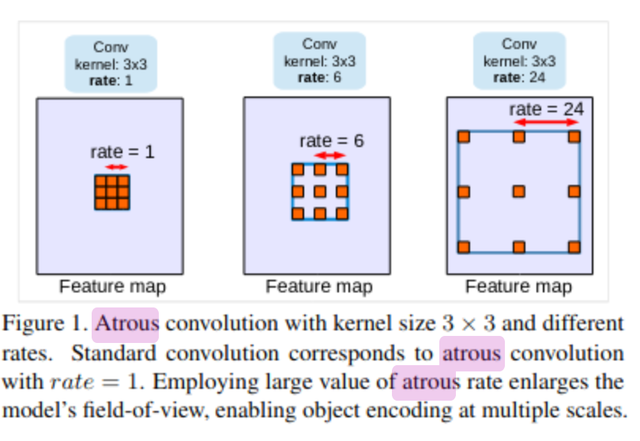
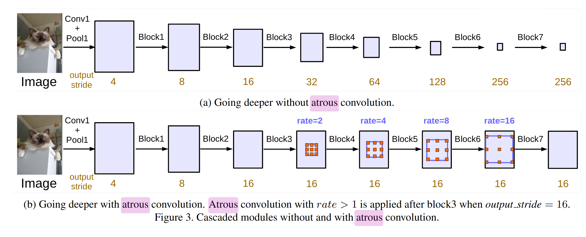
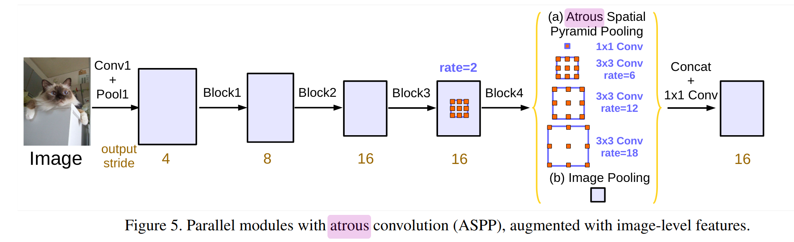

# [Rethinking Atrous Convolutions for Semantic Image Segmentation](https://arxiv.org/pdf/1706.05587v3.pdf)

## Key ideas
* Handle the problem of segmenting objects at multiple scales
* Atrous convolutions in cascade or parallel at multiple atrous rates
* Augment atrous spatial pyramid problem

## Introduction
* Two challenges:
  - reduced resolution by consecutive pooling operations: fixed by atrous convolutions
    - Remove downsampling operation from last few layers
    - And upsampling the corresponding filter kernels
    - Equivalent to inserting holes between filter weights
    
  - existence of objects at multiple scales:
    - use image pyramid + encoder-decoder + extra modules (DenseCRF) + spatial pyramid pooling
* Atrous spatial pyramid pooling (ASPP) experiment

## Related work
* Image Pyramid: same model, typically with shared weights, applied to different scales of the image
* Encoder-decoder: encoder where spatial dimension of feature maps is gradually reduced, decoder where object details + dimension are recovered
* Context module: DenseCRF for encoding long-range context
* Spatial pyramid pooling: captures context in several ranges, sometimes based on LSTM
* Atrous convolutions: Experiments with different atrous ranges to capture long-range information

## Methods
### Atrous convolutions for dense feature extraction
* Max-pooling + striding at consecutive layers reduces the spatial resolution of feature maps in DCNNs
* Atrous convolutions rate allows us to control how densely to compute features in CNNs

### Going deeper with atrous convolutions
* Duplicate several copies of the last ResNet block (block4) and arrange them in cascade
* 3x3 convolutions in these blocks with stride of 2 except the last one

### Atrous spatial pyramid pooling
* Four parallel atrous convolutions with different atrous rates applied on top of feature map

