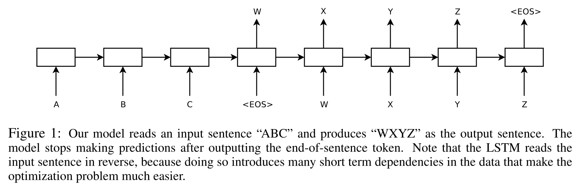

# [Sequence to Sequence with Neural Networks]()

## Key ideas
* DNNs work well with training sets but without them they can't be used to map sequences to sequences
* Our method maps input sequence through LSTM to a vector of fixed dimensionality, then another deep LSTM to decode the target sequence from the vector

## Introduction
* Despite DNN success, they need the target and input to be encoded in vectors of fixed dimensionality
* Many important problems dimensionality is not known a priori, such as machine translation and speech recognition
* Domain-independent sequence to sequences method would be useful
* LSTM 1 to obtain large fixed-dimensionality vector representation
* LSTM 2 to extract sequence from such vector

* Reversed order of words in source sequences but not target seems to improve accuracy

## Model
* RNN is a natural generalization of feedforward neural networks to sequences
* Given a sequence of inputs x_1, ..., x_T, a standard RNN computes a sequence of outputs y_1, ..., y_T by iterating:
  - h_t = sigm(W^hx * x_t + W^hh * h_t-1)
  - y t = W^yh * h_t
* A simple strategy for seq2seq learning is to map the input size to a fixed-size vector using one RNN and decode such vector to the target with another RNN
* The goal of the LSTM is to estimate conditional probability p(y|x) for a sequence xT and output yT' - where T' and T might differ in length
* Use 2 different LSTMS, deep (4 layers) for "encoding" "decoding"

## Experiments (skipped)
