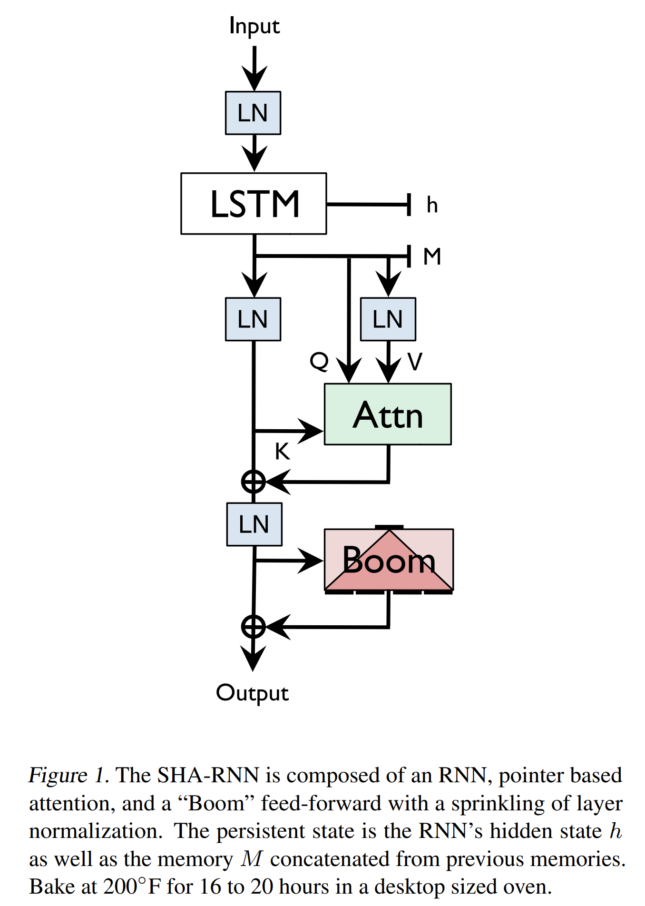
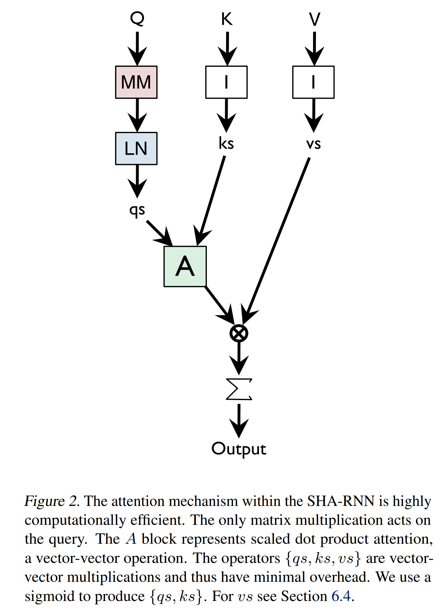

# [Single Headed Attention RNN: Stop Thinking With Your Head](https://arxiv.org/pdf/1911.11423v2.pdf)

## Key ideas
* If we had been obsessed with slightly different acronym than "Transformers", but used "SHA-RNN" instead, the field might have evolved differently
* We take LSTM based language model and move it towards SOTA with only 24h of GPU training in a commodity desktop

## Introduction
* Language is humanity's longest running program. History, wisdom, computation is all embedded in this long-running program.
* Predicting the n+1th token given the n preceding tokens is a foundational task of NLP
* If you ask a sufficiently big NN modeling language, you have nearly universal function approximation, but with language

## Motivation
* What if the "attention is all you need" paper was never published? Well - new progress will come out likely out of surrounding research areas
* In that case, we would have had to stick with LSTMs for longer than we did. Would we have reached the current SOTA?
* A lone GPU should be enough for this experiment since "what may take a cluster to computer one year takes a consumer machine the next"

## Method

* Boom layer because it takes a 1024 vector, turns it into 4096, then 1024 again.
* Simplified attention mechanism

## Discussion
* Tokenization attacks
* Improvements are easy in theory, hard in practice
* Minimum trust LAMB

## Conclusion
* SHA-RNN might not get as good resuls as Transformers but it requires next to no hyperparameter tuning
* Model performance and attention links might be more fuzzy than we might have guessed
