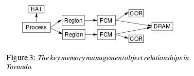
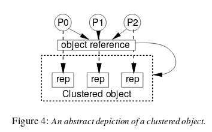

#[Tornado: maximizing locality and concurrency in a shared memory multiprocessor OS](http://static.usenix.org/events/osdi99/full_papers/gamsa/gamsa.pdf)

## Key ideas
* Every physical and virtual object is represented by a clustered object
* Protected procedure calls preserve locality and concurrency of IPC
* Locks are object specific

## Optimizing for locality means...
* Minimize read/write and write sharing to reduce cache overheads
* Minimize false sharing between processors
* Minimize the distance processor-memory particularly for NUMA systems

## Object-oriented structure
* Requests to different virtual resources are handled independently
* No shared data structures mean no shared locks
* Each resource (pager, scheduler, etc..) is represented by a different object in the OS

## Clustered objects
* Illusion of single object, but multiple 'representatives' or 'reps.'
* Certain components of the OS have to be shared, like:
  * DRAM manager
  * Process manager for a parallel program
* All clients call a clustered object reference that returns a local object rep
* Reps can be shared or processor independent
* Cached Object Representative (COR)
  * Single rep shared across all processors
  * OK, since it's read only and infrequently called
* Regions
  * One rep per cluster of processors (NUMA)
  * it's on the critical path for page faults, locality is important
* File cache manager
  * One rep per processor
  * Hash table for cache is distributed

## Keeping clustered objects consistent
* Reps have to be kept consistent between processors
* How? By sharing memory between reps or through PPC

## Applications of clustered objects
* Process object:
  * replicated to every processor where the process has a thread running
  * list of regions updated on demand

## Clustered object implementations
* Per-processor translation tables (clustered object reference to local rep)
* Pointer to the rep responsible for the local processor is returned
* Reps are only created on demand when first accessed
* If a call to a rep is null, the global miss handler will create and install a new
rep in the translation table

## Memory allocation
* Pools of memory are allocated per processor
* Memory is only intended to be used locally

## Synchronization
* Locking: encapsulate all locking within individual objects
* Existence guarantees: implemented via garbage collection. any object can be used at any time

## Garbage collection of object references
* Temporary reference: the ones that die after a thread die
* Permanent references: the ones held in shared memory. survive beyond the lifetime of a single thread
* 3 phases:
  1. Object ensures all persistent refs to it have been removed
  2. Object ensures all temporary refs have been removed
  3. Clustered object is destroyed and memory is freed

## IPC
* Protected procedure calls (similar to Exokernel)
* Call from client object to server object acts like a clustered object crossing protection domains.
* Involves a clustered object being sent to server, and returned
* Locality is preserved, as requests are serviced within server processor bounds
