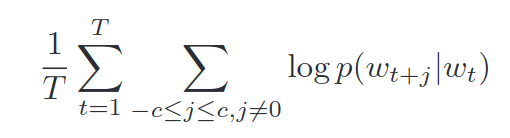
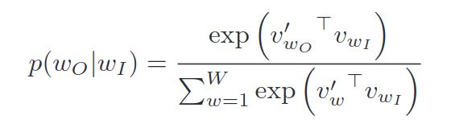
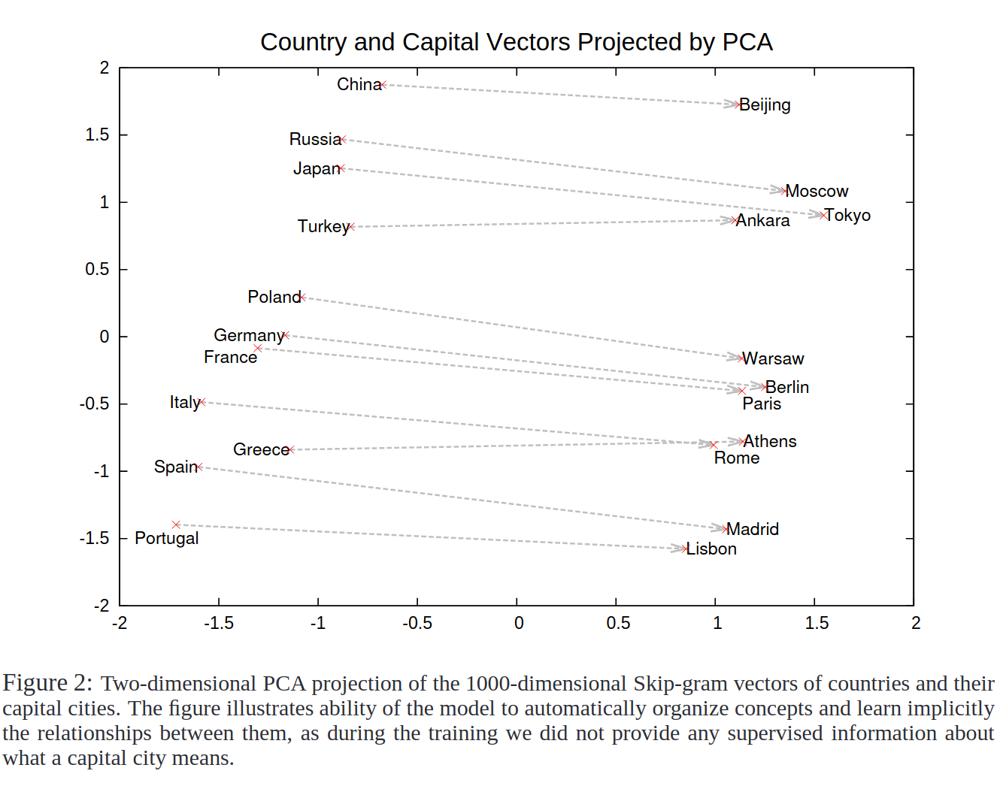
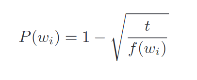
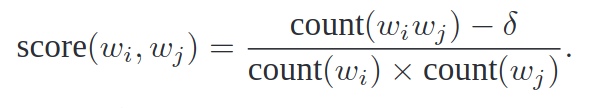
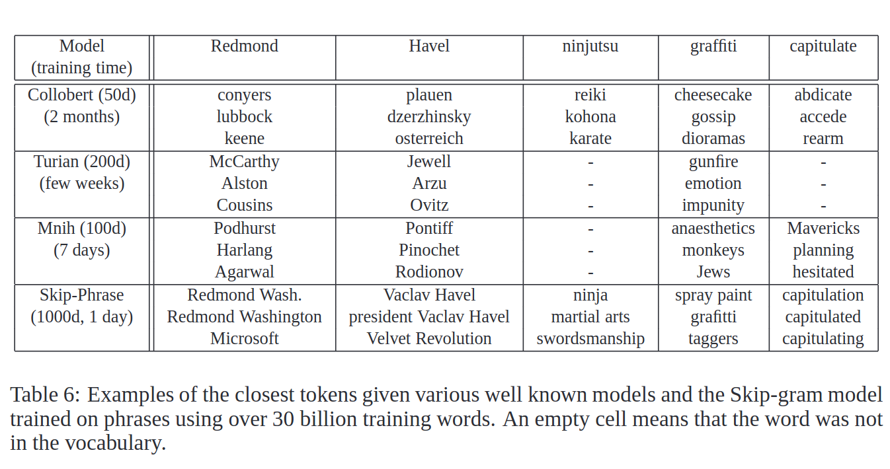

# [Distributed Representations of Words and Phrases and their Compositionality](https://papers.nips.cc/paper/2013/file/9aa42b31882ec039965f3c4923ce901b-Paper.pdf)

## Key ideas
* Extensions to skip-gram model to learn high-quality distributed vector representations
* Speed gains and more accurate representations
* Air + Canada cannot be easily combined to "Air Canada" - how to find such phrases in text

## Introduction
* Historically, grouping similar meanings close in the same vector space worked well
* More recently, skip-gram models are introduced - these don't need matrix multiplications and a single machine can train 100B words
* Surprisingly, linear translations such as vec("Madrid") - vec("Spain") + vec("France") = vec("Paris")
* Subsampling frequent words results in 2x-10x speedup
* Going from word model to phrase models such as "Air Canada", "Boston Globe" makes the model way more expressive
  - 1st identify phrases
  - 2nd treat phrases at individual tokens

## Skip-gram Model
* Objective: find word representations that are useful for predicting surrounding (-c, c) words
* Maximize the average log probability of

* Where v is input and v' is output

* This formulation is impractical due to the cost of computing the derivative of `log p(w0|w1)` - which is proportional to W, size of vocabulary
  - Hierarchical Softmax is an alternative: use binary Huffman tree to assign short codes to frequent words
  - Negative Sampling is another one: posits that noise should be different from data based on logistic regression

  - Subsampling of frequent words is another one: most words occur 100s of millions of times ('the', 'a', etc..)
    - Assuming this reality, "The France" provides a lot less meaning that "Paris, France".
    - After realizing frequent words often have less inherent meaning, we use the following formula to weigh rare words more.
    - Each word w_i is discarded with probability P(w_i) during training based on its frequency:
    - 

## Learning Phrases
* In theory we can train the skip-gram using all of the n-grams but that'd be too computationally intensive
* Phrases are similar to "Golden State Warriors", but also "Mark Zuckerberg", "Steve Ballmer", "New York Times"
* To find out which phrases are in the text, we use the following only for unigrams and bigrams:
  - 
* δ is used as a discounting coefficient and prevents too many phrases consisting of very infre-
quent words to be formed.
* Best representations of phrases are learned by a model with the hierarchical softmax and subsampling

## Additive Compositionality
* Why are words possible to meaningfully combine by element-wise addition of their vector representations?
  1. Word vectors are LINEARLY related to the inputs of the softmax nonlinearity
  2. Vectors are a representation of the context in which a word appears (since they are trained to predict before/after words)
  3. Product works here as AND: words that are assigned high probability by both vectors will have higher probability
  4. Thus, if "Volga River" appears with high probability close to "Russia" and "River", then vec("Russia") + vec("River") ~= vec("Volga River")

## Comparison
* Empirically, closer tokens are much closer in meaning than that of previous works
* Notice that even if word2vec was trained in 30B words, 2 orders of magnintude more than others - it's trained in 1 day!

## Other Conclusions
* Hyperparameter specification should be a task-specific decision.
