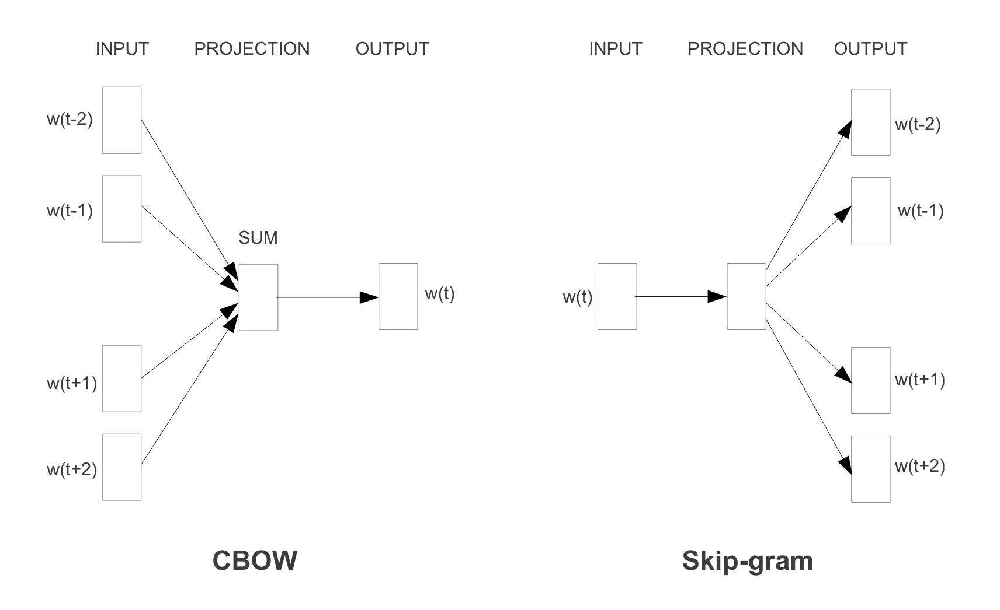
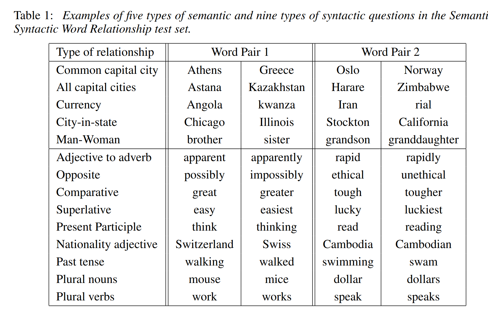

# [Efficient Estimation of Word Representations in Vector Space](https://arxiv.org/pdf/1301.3781v3.pdf)

## Key ideas
* Two novel architectures for computing continuous vector representations of words from large datasets

## Introduction
* Current NLP models treat words as atomic - no notion of similarity between words
* Simplicity rules all - e.g: n-grams which are just indices over a vocabulary
* Huge limitations if no meaning at all isn't conveyed in the representation
* Goal: techniques for learning high-quality word vectors from datasets with BILLIONS of words
  - Previous state of the art is low 100s of millions of words with a dimensionality of ~100
* Proposed technique to measure similarity between words
  - Moreover, words can have multiple degrees of similarity
  - Algebraic operators like `vector('King') - vector('Man') + vector('Woman') ~= vector('Queen')`

## Model Architectures
* Latent Semantic Analysis (LSA) and Latent Dirichlet Allocation (LDA) are discarded as they are computationally very expensive
* Maximize the accuracy while minimizing the complexity
### 1. Feedforward Neural Net Language Model (NNLM)
* Input: N previous words are encoded using 1-of-V encoding where V is the size of the vocabulary
* Projected to a layer P that has dimensionality N x D
* HxV dominates the computation (H being the hiden layer size)
* Q = N × D + N × D × H + H × V
* Huffman encoding helps with making this representation fast
### 2. Recurrent Neural Net Language Model (RNNLM)
* No need for projection layer P
* Q = H × H + H × V

## New proposed Architectures

* Continuous Bag Of Words model (CBOW)
  - Similar to NNLM
* Continuous skip-gram
  - Instead of predicting the current word based on context, maximize classification of word based on another word in the same sentence
  - Use each current word as input to log-linear classifier with a continuous projction layer and predict
  - Predict words within a range before and after

## Results
* How to prove that 'big' is similar to 'bigger' in the same sense as 'small' and 'smaller'?
* Performing algebraic operations: v('biggest') - vector('big') + vector('small') ~= vector('smallest')

