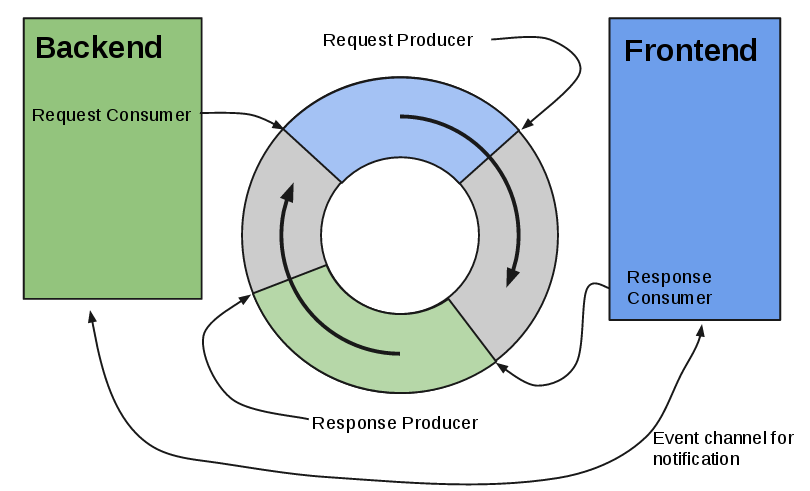

# [Xen and the art of virtualization](http://www.cl.cam.ac.uk/research/srg/netos/papers/2003-xensosp.pdf)

## Main ideas

* Introduction of paravirtualization vs full virtualization
* Guest OS can be aware of stuff happening in hypervisor and take advantage of it
* Mechanisms for paravirtualization

## Full virtualization drawbacks
* Efficient virtualization of the x86 memory management unit is messy.
* VMWare dynamically rewrites machine code from the guest OS to trap memory calls, which is very high-cost.
* The guest OS might need access to timers and real hardware to imrpove scheduling and networking.

## Alternative proposed: paravirtualization
* Needs modifications in the guest OS
  * Only the kernel. The programmer APIs remain untouched so applications are fully compatible.
* Guest OS runs on lower privilege level than Xen itself
* Page tables requested by the guest OS are managed by Xen.
  * Top 64MB of every address space is reserved for en

## I/O rings
* Mechanism for data transfer between Xen and guest OS.

* For example:
  * The Xen producer returns file descriptors for buffers for packet arrival
  * Guest OS consumer uses those buffers to put the packets

## CPU:
* In x86, privilege levels work in a ring model, 0 being the most privileged protection domain, 3 being the least. Traditionally 0 is the OS, 3 the application code.
  * Xen runs on ring 0
  * Guest OS runs on ring 1
  * Application code runs on ring 3
* Domain0 manages all other domains in terms of handling CPU, devices, memory...
* system calls and page fault handlers are registered to Xen

### Scheduling
* Borrowed virtual time algorithm.
* Fast and low latency wake up.
* Need for fast wake up calls as things like TCP rely on timely delivery of acks. These have to be scheduled in a low latency setting.

## Timers
* Real time - nanoseconds since boot
* Virtual time - active nanoseconds
* Wall clock time - offset to real time to take into account ntp, or timezones

## Virtual memory
* No shadow page tables or virtual page tables like in fully-virtualized VMware. Slow.
* Guest OS has:
  * Unrestricted read-only access to page tables
  * Supervised create/update/delete access to page tables
* Xen traps CUD calls and are validated before applied via hypercall
* Guest OS may locally queue updates to minimize the number of hypercalls

## Physical memory
* Reserved via ballooning driver (these days, virtio)
* Illusion of locality, contiguous memory for guest OS
* Reality: hardware memory will be sparse

## Disks
* domain0 has direct access to disk physical devices
* domain > 0 uses the Virtual Block Device (VBD) abstraction
* anatomy of a disk request:
  * Guest OS sends VBD identifier + offset
  * Xen makes permission checks, and returns sector address and physical device

## Skipped network and performance
