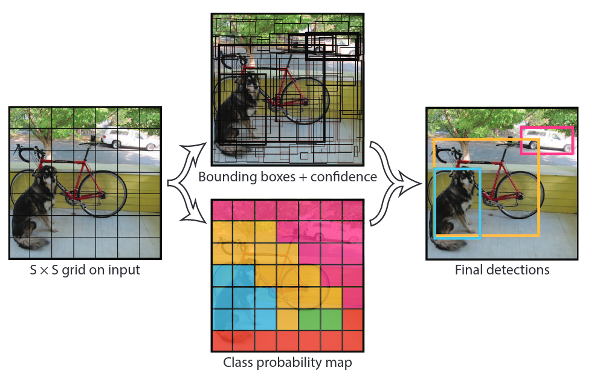
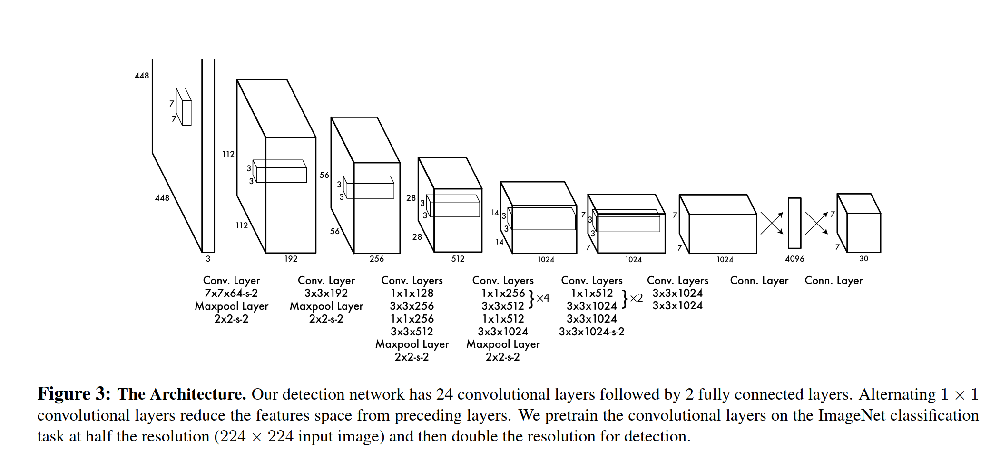

# [You Only Look Once: Unified, real-time object detection](https://www.cv-foundation.org/openaccess/content_cvpr_2016/papers/Redmon_You_Only_Look_CVPR_2016_paper.pdf)

## Key ideas
* Prior work repurposes classifiers for Object Detection
* YOLO formulates it as a regression problem of spatially separated bounding boxes and class probabilities
* Single NN predicts bounding boxes and class probabilties in one evaluation
* Resize input to 448x448, runs single CNN, thresholds the resulting decisions

## Introduction
* Base network runs at 45 fps on a Titan X GPU
* Able to process real time video with 25ms of latency
* YOLO reasons about the image globally, instead of regions

## Unified detection
* Unify separate components of object detection into single NN
* Divides image into SxS grid.
* If center of object falls in a cell, that cell is responsible for detecting the object

## Architecture

## Training
* Train CNN on ImageNet 1000 classes dataset
* Then convert the model to perform detection, add 4 layers that increase resolution from 224 to 448
* Final layer predicts a tensor of class probabilities and bbox coordinates
* Limitations: each grid can only have one class and predict two boxes
* Struggles with flocks of birds or similar smaller objects
