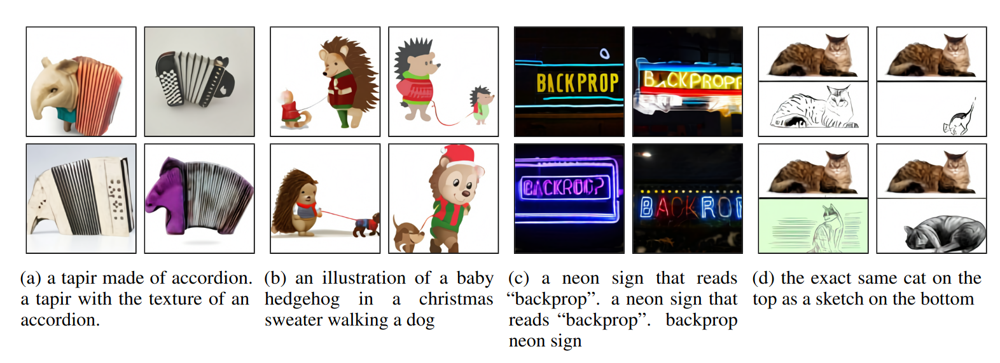
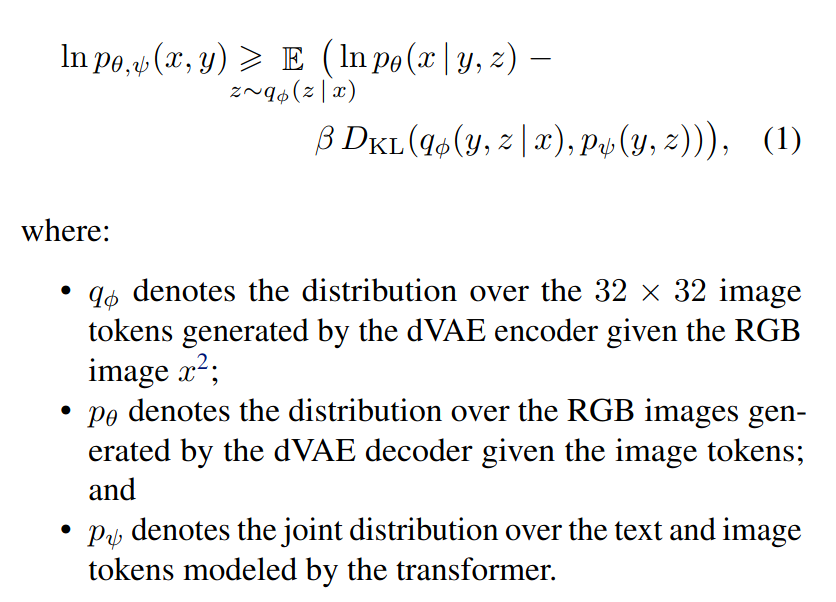

# [Zero-Shot Text-to-Image Generation](https://arxiv.org/pdf/2102.12092v2.pdf)

## Key ideas
* Transformer that autoregressively models the text and image tokens as a single stream of data
* Competitive with previous domain-specific models when evaluated in zero-shot domain

## Introduction

## Method
* Autoregressively model the text and image tokens as a single stream of data via Transformer
* 2 stages:
  - 1: discrete variational autoencoder training to compress 256x256 RGB to 32x32 grid of image tokens
  - 2: concatenate up to 256 Byte Pair-encoded text tokens with the 32x32=1024 image tokens, then train autoregressive transformer to model the joint distribution of text and image tokens
* Maximize the evidence lower bound as:

### TODO - revisit

